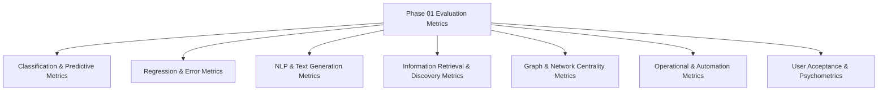

# Comprehensive Evaluation Metrics Taxonomy (Phase 01 Corpus)

This document provides a systematic, mathematical, and empirical inventory of all evaluation metrics, benchmarks, and measurement protocols documented across the **44 verified research papers** in the Phase 01 corpus.

> [!NOTE]
> All metric definitions, mathematical formulas, and numerical benchmarks recorded herein are transcribed directly from the verified primary source PDF research notes.

---

## 1. Multi-Dimensional Metric Taxonomy Overview

Evaluation approaches across the 44 reviewed papers span seven distinct metric classes:

---

## 2. Detailed Metric Classes and Reported Benchmarks

### 2.1. Supervised Classification Metrics

| Metric | Mathematical Formula | Usage in Reviewed Corpus | Top Reported Values in Literature |
|:---|:---|:---|:---|
| **Accuracy** | $(TP + TN) / (TP + TN + FP + FN)$ | General correctness across all classes (Paper 01, 04, 09, 10, 18, 19, 22, 24, 33, 34, 41, 44) | **94.75%** (Random Forest, Paper 22); **94.5%** (XGBoost 3-class, Paper 41); **89.5%** (TFT, Paper 44) |
| **Precision** | $TP / (TP + FP)$ | Positive predictive value; critical to avoid false employability assurances | **0.98** (Low class, Paper 41); **0.94** (High class, Paper 41); **0.84** (Paper 44) |
| **Recall / Sensitivity** | $TP / (TP + FN)$ | True positive rate; critical to capture all at-risk students needing intervention | **0.98** (Low class, Paper 41); **0.92** (High class, Paper 41); **0.78** (Paper 44 at Week 6) |
| **F1-Score** | $2 \times (\text{Precision} \times \text{Recall}) / (\text{Precision} + \text{Recall})$ | Harmonic mean of precision and recall for balanced evaluation | **0.98** (Low class, Paper 41); **0.93** (High class, Paper 41); **0.81** (Paper 44); Macro avg **0.94** |
| **Area Under ROC Curve (AUC-ROC)** | Area under True Positive Rate vs False Positive Rate curve | Threshold-independent discrimination power | **0.96** (Temporal Fusion Transformer, Paper 44); **0.91** (XGBoost, Paper 44); **0.90** (LSTM, Paper 44) |

---

### 2.2. Natural Language Processing & Generation Metrics

| Metric | Mathematical Formulation | Evaluated Dimension | Typical Literature Applications |
|:---|:---|:---|:---|
| **BLEU (BLEU-1 to BLEU-4)** | Geometric mean of modified n-gram precisions $\times$ brevity penalty | N-gram precision overlap with reference questions | Automatic Question Generation (Paper 25, 26, 39); reported weakly correlated with pedagogical validity in Paper 39 |
| **ROUGE (ROUGE-L)** | Longest Common Subsequence (LCS) recall/F1 | Summary and question recall coverage | Automatic question generation evaluation (Paper 25, 26, 39) |
| **Cosine Semantic Similarity** | $\cos(\theta) = (\mathbf{u} \cdot \mathbf{v}) / (\|\mathbf{u}\| \|\mathbf{v}\|)$ | Dense embedding alignment in vector space | SBERT resume-to-job matching (Paper 12, 17, 28, 35, 36, 40, 43) |
| **TF-IDF Keyword Similarity** | Vector dot product over normalized term frequency-inverse document frequency | Lexical skill and keyword overlap | Resume parsing and candidate ranking (Paper 11, 36, 37) |

---

### 2.3. Information Retrieval & Knowledge Discovery Metrics

| Metric | Mathematical Formula | Usage in Reviewed Corpus | Reported Literature Benchmarks |
|:---|:---|:---|:---|
| **Average Retrieval Time ($ART_s$)** | $ART_s = \frac{1}{n}\sum_{i=1}^n t_i$ | Operational latency per repository query | Semantic Scholar (**1.124s**); Europe PMC (**1.318s**); OpenAlex (**3.646s**) (Paper 43, PDF p. 6) |
| **Information Overload Reduction (%)** | $(1 - P_{\text{filtered}} / P_{\text{retrieved}}) \times 100$ | Elimination of irrelevant documents via semantic filtering | **~90% reduction** on complex LIS queries in Europe PMC; **>70%** for recommendation systems (Paper 43) |
| **Precision@k / Recall@k** | Proportion of top-$k$ recommendations that are relevant | Skill extraction and vacancy matching | Evaluated in implicit skill recommendation (Paper 35) |

---

### 2.4. Graph Topology & Network Analytics Metrics

| Metric | Definition & Meaning | Source Evidence & Literature Benchmarks |
|:---|:---|:---|
| **Modularity Score ($Q$)** | Measure of the density of links inside communities compared to links between communities ($Q \in [-0.5, 1.0]$) | **$Q = 0.4442$** via Greedy Modularity on heterogeneous Student–Faculty–Industry graph (Paper 41, PDF p. 14) |
| **Community Count ($k$)** | Total structurally cohesive sub-clusters identified | **$k = 12$ communities** identified across 1,150 nodes and 2,908 edges (Paper 41) |
| **Centrality Indices** | Degree, Betweenness, and Eigenvector centrality quantifying hub importance | Hub skill identification in academic and library graphs (Paper 41, Paper 43) |

---

### 2.5. Operational & Automation Impact Metrics

| Operational Metric | Baseline Performance | Post-IDP Performance | Net Relative Impact Reported |
|:---|:---:|:---:|:---:|
| **Document Processing Turnaround Time** | 100% | 35% | **$\downarrow 65\%$ reduction** (Paper 42, PDF p. 9) |
| **Data Entry Error Rate** | 100% | 10% | **$\downarrow 90\%$ reduction** (Paper 42, PDF p. 9) |
| **Manual Review Labor Effort** | 100% | 30% | **$\downarrow 70\%$ reduction** (Paper 42, PDF p. 9) |
| **SLA Compliance Rate** | 60% | 92% | **$\uparrow 53\%$ improvement** (Paper 42, PDF p. 9) |
| **Audit Readiness Score** | 40% | 85% | **$\uparrow 112.5\%$ improvement** (Paper 42, PDF p. 9) |

---

### 2.6. User Acceptance & Educational Impact Metrics

| Metric / Instrument | Scale / Design | Sample Size & Construct Scores | Literature Evidence Location |
|:---|:---|:---|:---|
| **Technology Acceptance Model (TAM)** | 5-point Likert scale (1=Strongly Disagree to 5=Strongly Agree) | $N = 267$ students (Paper 40): Overall Mean = **4.097** (High); Perceived Usefulness = **4.138**; Ease of Use = **4.023**; Intention to Use = **4.129**; Peer Recommendation = **4.251** | Paper 40, PDF p. 11–12, Tables 2 & 3 |
| **Randomized Controlled Trial (RCT) Course Failure Rate** | Controlled comparison: Control ($n=225$) vs. Treatment ($n=225$) | Control: **18.2%** failure vs. Treatment: **10.7%** failure (**$\downarrow 41.2\%$ relative reduction** via AI interventions) | Paper 44, PDF p. 7, Table 2 |
| **RCT Weekly Engagement Score** | Continuous engagement index (scale 0–100) | Control: **62.5 / 100** vs. Treatment: **82.8 / 100** (**$\uparrow 32.4\%$ relative increase**) | Paper 44, PDF p. 7, Table 2 |
| **Advisor Trust Agreement (%)** | Practitioner survey ($n=15$ advisors) | **93%** agreement that SHAP increases AI prediction trust; **87%** agreement that SHAP guides outreach | Paper 44, PDF p. 7 |
| **Psychometric Item Indices** | Classical test theory: Difficulty ($P$), Discrimination ($D$) | Reported across educational AQG literature (Paper 39); highlighted as severely underreported | Paper 39, PDF p. 28–36 |

---

## 3. Critical Metric Implications for ScholarCamp / PRIE

1. **Prioritize AUC and Recall over Raw Accuracy**: In placement risk prediction, high recall (capturing true at-risk students) is far more critical than raw accuracy, because false negatives leave struggling students without timely remediation.
2. **Move Beyond Lexical Overlap in AQG**: Standard NLP metrics like BLEU and ROUGE correlate poorly with human pedagogical judgment (as proven in Paper 39). ScholarCamp must evaluate generated questions using rubric-based pedagogical dimensions (Bloom's cognitive level, clarity, distractor plausibility) and human/expert rating protocols.
3. **Incorporate Multi-Stakeholder Graph & TAM Validation**: Institutional deployment success depends both on technical graph modularity ($Q > 0.4$) and verified student acceptance (TAM mean $> 4.0$).
