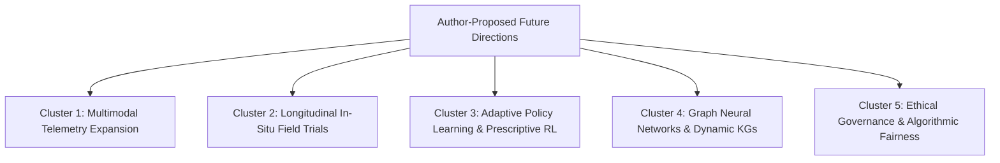

# Future Research Directions and System Ideas (Phase 01 Corpus)

This document compiles future research directions, open technical opportunities, and system enhancement concepts explicitly proposed by original authors across the **44 verified research papers** in the Phase 01 corpus.

> [!NOTE]
> All future ideas listed herein are synthesized directly from Section 19 ("Future Work") and Section 18 ("Limitations") of the verified paper notes.

---

## 1. Thematic Clustering of Future Research Directions

Across the reviewed literature, authors explicitly call for future advancements across five primary clusters:

---

## 2. Detailed Future Work Proposed by Authors

### Cluster 1: Multimodal Telemetry and Sensor Fusion in Interview Simulation
- **Author Proposals**:
  - Kulkarni et al. (Paper 38, PDF p. 5) explicitly call for moving beyond text-based interview evaluations by integrating real-time audio prosody (pitch, vocal tone, speech fluency) and computer vision (facial emotion, eye contact, body posture).
  - Inamdar et al. (Paper 15) and Wahid et al. (Paper 29) propose combining speech-to-text transcription with continuous physiological signals and gaze-tracking to assess stress tolerance during high-stakes technical interviews.
- **Relevance for ScholarCamp**: Informs the planned phase-wise evolution of the Mock Interview subsystem from text Q&A to fully multimodal interview analysis.

### Cluster 2: Longitudinal In-Situ Field Studies & Causal Learning Trials
- **Author Proposals**:
  - Murti et al. (Paper 40, PDF p. 17) emphasize that demonstration-based surveys are insufficient and demand semester-long longitudinal field studies tracking authentic student usage in credit-bearing courses.
  - Azeez & Sajjad (Paper 44, PDF p. 8) advocate expanding randomized controlled trials across diverse STEM and multidisciplinary cohorts to observe the long-term sustainability of AI-driven nudges.
  - Babureddy & Mathew (Paper 41, PDF p. 24) recommend tracking graduates 6, 12, and 24 months post-graduation to measure actual workplace career progression.
- **Relevance for ScholarCamp**: Validates ScholarCamp's research roadmap to partner with universities for multi-semester cohort studies rather than relying solely on post-hoc cross-sectional surveys.

### Cluster 3: Reinforcement Learning & Prescriptive Interventions
- **Author Proposals**:
  - Azeez & Sajjad (Paper 44) demonstrate the success of Proximal Policy Optimization (PPO) for weekly academic interventions and call for extending contextual multi-armed bandits and reinforcement learning to dynamic student goal setting.
  - Gugnani & Misra (Paper 35) propose reinforcement-learning-based job recommendation agents that learn from recruiter interview invitations and candidate application outcomes.
- **Relevance for ScholarCamp**: Provides direct theoretical backing for PRIE's prescriptive engine: dynamically tailoring daily practice tasks to maximize a student's readiness trajectory.

### Cluster 4: Graph Neural Networks (GNNs) and Dynamic Knowledge Graphs
- **Author Proposals**:
  - Rajeevan & Mini Devi (Paper 43, PDF p. 15) propose transforming static post-retrieval knowledge graphs into dynamic, streaming knowledge graphs with automated ontology enrichment.
  - Babureddy & Mathew (Paper 41) suggest applying Graph Convolutional Networks (GCNs) and Graph Attention Networks (GATs) directly on heterogeneous Student–Faculty–Industry graphs to infer implicit mentoring connections and predict placement success.
- **Relevance for ScholarCamp**: Suggests upgrading PRIE's skill-gap graph from static NetworkX community clustering to relational Graph Neural Networks for automated learning path discovery.

### Cluster 5: Algorithmic Fairness, Bias Mitigation, and Ethical AI Governance
- **Author Proposals**:
  - Talmoudi & Ben Ghezala (Paper 32, 2026) and Chen & Hwang (Paper 05, 2024) emphasize the critical urgency of addressing algorithmic bias against underrepresented demographic groups in educational decision-making.
  - Kapula (Paper 42) and Murti et al. (Paper 40) underscore that automated document parsing and generative chatbots require robust data privacy protocols (GDPR, FERPA) and transparent institutional human-in-the-loop oversight.
- **Relevance for ScholarCamp**: Mandates strict algorithmic fairness audits within PRIE to ensure that demographic attributes (gender, regional background) do not bias placement readiness scoring or recruiter recommendations.
