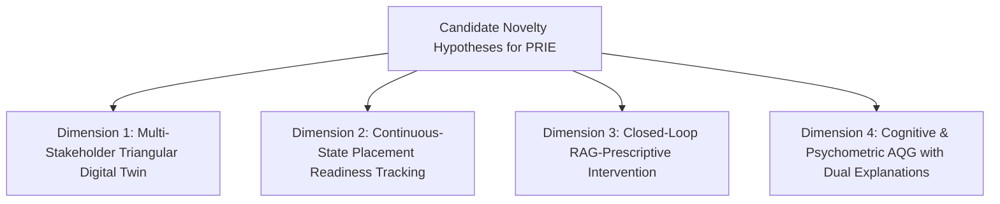

# Research Positioning and Candidate Novelty Dimensions (Phase 01)

This document articulates the cautious academic positioning of the **ScholarCamp** ecosystem and its core analytical system, the **Placement Readiness Intelligence Engine (PRIE)**, relative to the verified research literature.

> [!WARNING]
> **Strict Phase 01 Scoping Rule**: Phase 01 does not prove final novelty. Definitive novelty claims, priority assertions, and formal superiority hypotheses belong strictly to Phase 02 and Phase 03. The dimensions outlined below represent **candidate novelty hypotheses** identified *within the reviewed corpus* that require empirical validation.

---

## 1. Contextual Positioning Principles

In formulating the research claims for ScholarCamp / PRIE, the following principles govern our scientific posture:
1. **No Absolute Exclusivity Claims**: We avoid phrasing such as *"No existing system does X"* or *"PRIE is the first to achieve Y"*.
2. **Cautious Evidence-Grounded Phrasing**: We frame candidate innovations using language such as:
   - *"Within the reviewed corpus of 44 primary studies..."*
   - *"Among the papers available for empirical verification..."*
   - *"The reviewed literature indicates a scarcity of..."*
   - *"Preliminary evidence suggests that integrating X with Y addresses an observed gap in..."*

---

## 2. Candidate Novelty Dimensions Identified Relative to Corpus

### Candidate Dimension 1: Triangular Multi-Stakeholder Intelligence Integration
- **Status in Reviewed Literature**: While Babureddy & Mathew (Paper 41, 2026) introduced a triangular survey-based digital twin, existing systems are overwhelmingly single-stakeholder (student-only).
- **Candidate PRIE Hypothesis**: Synthesizing student continuous telemetry, faculty mentor intervention logs, and live corporate recruiter skill demand models into an ongoing digital twin state space represents a promising, under-explored architectural integration within the reviewed literature.

### Candidate Dimension 2: Continuous-State Longitudinal Readiness Representation
- **Status in Reviewed Literature**: Current systems evaluate placement readiness via one-off cross-sectional assessments (e.g., Paper 01, 09, 22). While Azeez & Sajjad (Paper 44, 2026) applied Temporal Fusion Transformers to semester course dropouts, longitudinal multi-horizon modeling has not been widely integrated into multi-modal career readiness ecosystems.
- **Candidate PRIE Hypothesis**: Formulating graduate placement readiness as a dynamic, continuous temporal state vector—continuously updated via multimodal mock interview scores, ATS resume iterations, and technical challenge submissions—addresses the static limitation observed in existing models.

### Candidate Dimension 3: Closed-Loop Prescriptive Remediation (Moving Beyond Risk Prediction)
- **Status in Reviewed Literature**: Most employability prediction tools stop at generating a risk label or static SHAP summary (Paper 01, 18, 19). Very few papers (notably Paper 44's RL trial) implement an automated closed loop that routes predicted deficiencies into targeted pedagogical interventions.
- **Candidate PRIE Hypothesis**: Linking explainable feature attributions (TreeSHAP / LIME) directly to an institutional RAG curriculum engine—generating personalized, actionable remediation roadmaps rather than passive diagnostic alerts—provides a cohesive solution to the prediction-to-action gap.

### Candidate Dimension 4: Psychometrically Calibrated AQG with Two-Way Explanatory Feedback
- **Status in Reviewed Literature**: Kurdi et al. (Paper 39) and Wiharto et al. (Paper 26) demonstrate that educational question generation is plagued by lower-order cognitive recall items, uncalibrated difficulty models, and a near-total absence of feedback.
- **Candidate PRIE Hypothesis**: Designing an automated technical question generation pipeline anchored on Bloom's higher cognitive levels (scenario debugging, architectural trade-offs), calibrated via empirical item-response metrics, and providing rich two-way explanatory feedback (rationales for both the correct key and each distractor) directly targets documented weaknesses in the reviewed literature.

---

## 3. Empirical Validation Protocol Required for Phase 02 / Phase 03

To formally substantiate these candidate novelty dimensions in subsequent phases, the research team must execute:
1. **Component-Level Ablation Studies**: Dissecting PRIE's performance with and without faculty/industry features to prove triangular integration superiority.
2. **Comparative Benchmark Experiments**: Benchmarking PRIE's longitudinal TFT against standard static classifiers (RF, SVM, XGBoost) on identical institutional cohorts.
3. **Controlled User Intervention Trials**: Conducting prospective trials (modeled after Paper 44's RCT) measuring actual student placement offer rates and readiness uplifts relative to unassisted preparation.
