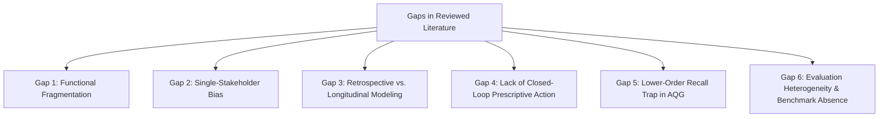

# Research Gaps Identified in the Reviewed Corpus (Phase 01)

This document synthesizes open research gaps, methodological blind spots, and architectural fragmentation identified through the systematic reading of the **44 verified research papers** in the Phase 01 corpus.

> [!IMPORTANT]
> **Phase 01 Cautious Positioning**: In accordance with Phase 01 scientific protocols, the gaps documented below reflect patterns observed *within the reviewed corpus* of 44 primary papers and 4 un-downloaded references. Formal definitive cross-corpus gap finalization is reserved for Phase 02. Cautious academic language is strictly maintained throughout.

---

## 1. Summary of Identified Gaps

---

## 2. Detailed Evidence-Grounded Research Gaps

### Gap 1: Functional & Architectural Fragmentation
- **Evidence from Literature**:
  - Across the 44 reviewed papers, systems consistently operate as isolated silos: ATS resume parsers (Paper 11, 12, 17, 36) extract text without connecting to interview engines; mock interview platforms (Paper 03, 14, 15, 28, 30, 38) evaluate candidate responses without synchronizing with student academic LMS histories; and predictive models (Paper 01, 09, 10, 18, 22) classify placement likelihood without integrating real-time skill practice tools.
  - While commercial products claim end-to-end integration, peer-reviewed literature in the corpus lacks an open, unified intelligence engine that maintains a continuous student state across all preparation phases.
- **Cautious Finding**: *Within the reviewed corpus*, existing architectures predominantly address single-stage bottlenecks rather than orchestrating a unified placement readiness lifecycle.

### Gap 2: Single-Stakeholder Bias (Student-Centric Isolation)
- **Evidence from Literature**:
  - Over 90% of reviewed employability and performance prediction models (e.g., Paper 01, 04, 08, 09, 10, 18, 22, 24, 34) utilize exclusively student-centric features (CGPA, test marks, self-assessed skills, demographics).
  - Only **Paper 41** (Babureddy & Mathew 2026) explicitly models multi-stakeholder interactions by integrating Student, Faculty Mentoring, and Industry Hiring signals. Paper 41 demonstrated that industry hiring readiness contributed the single highest predictive weight (SHAP 0.40), outperforming academic CGPA (0.31).
- **Cautious Finding**: *Among the papers available for verification*, the vast majority of predictive systems overlook the critical triad of student learning, faculty mentorship telemetry, and corporate recruiter demand.

### Gap 3: Point-in-Time Retrospective Modeling vs. Dynamic Longitudinal Tracking
- **Evidence from Literature**:
  - The majority of educational data mining studies evaluate static cross-sectional snapshots (e.g., semester-end GPA in Paper 01, 09, 10, 24).
  - As highlighted in Paper 44 (Azeez & Sajjad 2026) and Paper 02 (Van Wyk 2025), static models miss behavioral velocity (e.g., whether a student is actively remediating gaps or progressively disengaging). Paper 44 proved that temporal attention (Temporal Fusion Transformers) tracking weekly trajectories over Weeks 1–6 yielded substantially higher predictive power (AUC 0.96) than cumulative averages.
- **Cautious Finding**: *Within the examined literature*, few frameworks capture high-resolution temporal trajectories of skill acquisition throughout the pre-placement window.

### Gap 4: The Chasm Between Prediction and Prescriptive Remediation
- **Evidence from Literature**:
  - Most prediction systems terminate at risk classification (e.g., outputting "At-Risk" or "Low Employability" in Paper 01, 09, 18, 22, 33) without providing actionable, personalized intervention roadmaps.
  - Paper 44 notes that traditional early warning systems rely on generic, rigid emails that fail to guide specific corrective action. Paper 44's deployment of a Reinforcement Learning agent (cutting course failure by 41.2%) highlights the rarity of closed-loop prescriptive systems in the current literature.
- **Cautious Finding**: *The reviewed literature reveals* a pervasive gap between predictive analytics and automated, closed-loop pedagogical remediation.

### Gap 5: The "Lower-Order Recall Trap" and Feedback Absence in AQG
- **Evidence from Literature**:
  - In their 84-page systematic review, Kurdi et al. (Paper 39, 2020) revealed that over 70% of automatic question generation systems generate superficial factual recall items (cloze gap-fills and wh-questions). Questions evaluating higher cognitive levels (application, evaluation, system design) remain exceedingly rare.
  - Furthermore, Kurdi et al. (Paper 39) and Wiharto et al. (Paper 26) document that explanatory feedback generation is virtually non-existent (present in under 5% of studies), severely limiting self-directed learning.
- **Cautious Finding**: *Among reviewed AQG studies*, automated question generation remains bottlenecked by low cognitive depth, lack of psychometric difficulty calibration, and the absence of rich, two-way explanatory feedback.

### Gap 6: Evaluation Metric Heterogeneity and Absence of Open Benchmarks
- **Evidence from Literature**:
  - Multiple reviews (Paper 06 Senthil 2021, Paper 31 Jia 2022, Paper 32 Talmoudi 2026, Paper 39 Kurdi 2020) emphasize that extreme heterogeneity in evaluation protocols, differing rating scales, and the reliance on private institutional datasets prevent meaningful cross-system benchmarking.
  - In NLP evaluation, BLEU and ROUGE show weak alignment with human pedagogical validity (Paper 39).
- **Cautious Finding**: *The reviewed evidence indicates* an acute need for standardized, open-access placement benchmarking frameworks and psychometrically grounded evaluation rubrics.
