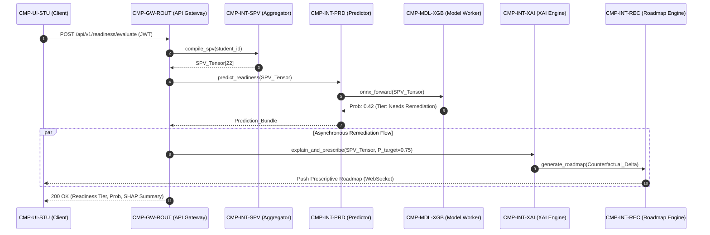

# PRIE Component Architecture: Structural Decoupling, Interfaces & Lifecycle Management

**Project**: ScholarCamp — AI-Powered Placement Readiness Ecosystem  
**Core Research System**: PRIE — Placement Readiness Intelligence Engine  
**Document**: `05_PRIE_Architecture/Component_Architecture.md`  
**Phase**: 05 — PRIE Architecture  
**Status**: Authoritative Component Specification  
**Corpus Grounding**: Phase 01 (`01_Research_Foundation/`), Phase 02 (`02_Cross_Analysis/`), Phase 03 (`03_Research_Problem/`), Phase 04 (`04_Research_Evidence/`)  
**Date**: September 2026  

---

## 1. Architectural Scope & Component Principles

The Component Architecture defines the physical and logical boundaries of all functional blocks in PRIE. It establishes:
1. **Single Responsibility**: Each component manages a mathematically or operationally distinct task.
2. **Interface Decoupling**: Components communicate strictly through versioned contracts (gRPC protobufs, OpenAPI REST, or typed message schemas).
3. **Fault Containment**: Component failures must degrade gracefully without taking down the core predictive engine or compromising data privacy.
4. **State Isolation**: Intelligence components are strictly stateless; all persistent state resides within Layer 5 data stores.

---

## 2. Master Component Inventory & Topology

```
┌────────────────────────────────────────────────────────────────────────┐
│ 1. PRESENTATION & INTERACTION COMPONENTS (LAYER 1)                      │
│ ┌──────────────┐ ┌──────────────┐ ┌──────────────┐ ┌─────────────────┐ │
│ │  CMP-UI-STU  │ │  CMP-UI-FAC  │ │  CMP-UI-TPO  │ │   CMP-UI-INT    │ │
│ │  Student Hub │ │  Mentor Hub  │ │  Admin Hub   │ │   Wasm Perceiver│ │
│ └──────────────┘ └──────────────┘ └──────────────┘ └─────────────────┘ │
└───────────────────────────────────┬────────────────────────────────────┘
                                    │ HTTPS / WSS
┌───────────────────────────────────▼────────────────────────────────────┐
│ 2. APPLICATION & SECURITY GATEWAY COMPONENTS (LAYER 2)                 │
│ ┌──────────────┐ ┌──────────────┐ ┌──────────────┐ ┌─────────────────┐ │
│ │  CMP-GW-AUTH │ │  CMP-GW-ROUT │ │  CMP-GW-PRIV │ │   CMP-GW-RATE   │ │
│ │  JWT / RBAC  │ │  Dispatcher  │ │  DP Noise Eng│ │   Token Bucket  │ │
│ └──────────────┘ └──────────────┘ └──────────────┘ └─────────────────┘ │
└───────────────────────────────────┬────────────────────────────────────┘
                                    │ Internal Request Bus
┌───────────────────────────────────▼────────────────────────────────────┐
│ 3. INTELLIGENCE & REASONING COMPONENTS (LAYER 3)                       │
│ ┌──────────────┐ ┌──────────────┐ ┌──────────────┐ ┌─────────────────┐ │
│ │  CMP-INT-SPV │ │  CMP-INT-ATS │ │  CMP-INT-QZ  │ │   CMP-INT-GAP   │ │
│ │  SPV Compiler│ │  Layout Match│ │  Adaptive Qz │ │   Distance Eng  │ │
│ ├──────────────┤ ├──────────────┤ ├──────────────┤ ├─────────────────┤ │
│ │  CMP-INT-INT │ │  CMP-INT-PRD │ │  CMP-INT-XAI │ │   CMP-INT-REC   │ │
│ │  Dialogue Mgr│ │  Dual Predict│ │  DiCE Recourse│ │   DAG Traversal │ │
│ ├──────────────┤ ├──────────────┤ ├──────────────┤ ├─────────────────┤ │
│ │  CMP-INT-RAG │ │  CMP-INT-AQG │ │  CMP-INT-TEL │ │   CMP-INT-DTW   │ │
│ │  Triad Verif │ │  Causal CoT  │ │  Cadence / S | │   Twin Sync Mgr │ │
│ └──────────────┘ └──────────────┘ └──────────────┘ └─────────────────┘ │
└───────────────────────────────────┬────────────────────────────────────┘
                                    │ Model Execution Protocol
┌───────────────────────────────────▼────────────────────────────────────┐
│ 4. MODEL EXECUTION & INFERENCE WORKERS (LAYER 4)                       │
│ ┌──────────────┐ ┌──────────────┐ ┌──────────────┐ ┌─────────────────┐ │
│ │  CMP-MDL-XGB │ │  CMP-MDL-TFT │ │  CMP-MDL-DOC │ │   CMP-MDL-SEM   │ │
│ │  ONNX XGBoost│ │  PyTorch TFT │ │  LayoutLMv3  │ │   SBERT Bi-Enc  │ │
│ ├──────────────┤ ├──────────────┤ ├──────────────┤ ├─────────────────┤ │
│ │  CMP-MDL-ASR │ │  CMP-MDL-SHP │ │  CMP-MDL-CF  │ │   CMP-MDL-LLM   │ │
│ │  Chunked Whsp│ │  TreeSHAP C++│ │  DiCE Solver │ │   Local vLLM 8B │ │
│ └──────────────┘ └──────────────┘ └──────────────┘ └─────────────────┘ │
└───────────────────────────────────┬────────────────────────────────────┘
                                    │ Storage Protocols (SQL, Vector, DAG)
┌───────────────────────────────────▼────────────────────────────────────┐
│ 5. STORAGE & KNOWLEDGE ENGINES (LAYER 5)                               │
│ ┌──────────────┐ ┌──────────────┐ ┌──────────────┐ ┌─────────────────┐ │
│ │  CMP-DAT-SPV │ │  CMP-DAT-VEC │ │  CMP-DAT-DAG │ │   CMP-DAT-LOG   │ │
│ │  PostgreSQL  │ │  ChromaDB    │ │  NetworkX/Neo│ │   TimescaleDB   │ │
│ └──────────────┘ └──────────────┘ └──────────────┘ └─────────────────┘ │
└───────────────────────────────────┬────────────────────────────────────┘
                                    │ Virtualization & Messaging
┌───────────────────────────────────▼────────────────────────────────────┐
│ 6. INFRASTRUCTURE & EXECUTION PLATFORM (LAYER 6)                       │
│ ┌──────────────┐ ┌──────────────┐ ┌──────────────┐ ┌─────────────────┐ │
│ │  CMP-INF-BOX │ │  CMP-INF-BUS │ │  CMP-INF-REG │ │   CMP-INF-OBS   │ │
│ │  Docker Exec │ │  Redis Broker│ │  Artifact Reg│ │   Prometheus    │ │
│ └──────────────┘ └──────────────┘ └──────────────┘ └─────────────────┘ │
└────────────────────────────────────────────────────────────────────────┘
```

---

## 3. Detailed Component Specifications

### 3.1 Layer 1: Presentation & Client Components
- **`CMP-UI-STU` (Student Hub Component)**:
  - *Responsibilities*: Renders interactive 22-dimensional readiness radar charts, DiCE counterfactual remediation roadmaps, and adaptive practice quizzes.
  - *Inputs*: Profile state JSON, roadmap milestones, quiz payloads.
  - *Outputs*: Quiz submissions, code edits, goal selections.
- **`CMP-UI-INT` (Client-Side Wasm Perception Component)**:
  - *Responsibilities*: Ingests local webcam video stream inside browser; runs MediaPipe FaceMesh compiled to WebAssembly at 30 FPS; computes non-verbal telemetry (`behavior_score` features: blink rate, gaze stability, head tilt); streams audio via WebSocket in 250ms chunks.
  - *Security Boundary*: **Zero raw video frames transmit to server**. Transmits only computed numeric scalar telemetry and audio chunks (`DD-005`, `DD-011`).

### 3.2 Layer 2: Application Gateway & Security Components
- **`CMP-GW-AUTH` (Authentication & RBAC Component)**:
  - *Responsibilities*: Verifies asymmetric JWT tokens; validates user role (Student, Faculty Advisor, Placement Officer, Recruiter, Admin); enforces fine-grained permission scopes.
- **`CMP-GW-PRIV` (Differential Privacy Proxy Component)**:
  - *Responsibilities*: Intercepts analytical aggregate queries originating from corporate recruiters and faculty dashboards; evaluates privacy budget exhaustion; injects calibrated Laplace noise ($b = \Delta f / \epsilon$ with $\epsilon \le 1.0$) (`DD-011`).
  - *Failure Mode*: Rejects queries if cumulative cohort privacy budget $\epsilon_{\text{total}} > 1.0$.

### 3.3 Layer 3: Intelligence & Reasoning Components (M01–M12)
- **`CMP-INT-SPV` (M01: SPV Aggregator & Harmonizer)**:
  - *Responsibilities*: Pulls raw data from academic transcripts, resume parsing, coding sandboxes, and interview telemetry; validates data types; imputes missing entries via median/MICE; computes continuous normalizations; compiles immutable 22-dimensional feature tensor `SPV_t`.
  - *Interface*: `compile_spv(student_id: UUID, timestamp: DateTime) -> SPV_Tensor[22]`.
- **`CMP-INT-ATS` (M02: Resume Intelligence Matcher)**:
  - *Responsibilities*: Coordinates LayoutLMv3 2D spatial token classification; formats extracted skills and project summaries; dispatches text to Sentence-BERT; computes dense cosine similarity and structural hygiene score (`F13`, `F14`).
  - *Interface*: `parse_and_match(resume_bytes: bytes, target_jd_id: UUID) -> ATS_Result`.
- **`CMP-INT-GAP` (M04: Skill Gap & Distance Engine)**:
  - *Responsibilities*: Evaluates candidate competency vector against target corporate role taxonomy; calculates weighted Euclidean distance ($L_2$) and missing critical skill flags (`F15: gap_score`).
  - *Interface*: `compute_gap(student_spv: SPV_Tensor, target_role_id: str) -> Skill_Gap_Vector`.
- **`CMP-INT-PRD` (M06: Placement Readiness Predictor)**:
  - *Responsibilities*: Routes current SPV to `CMP-MDL-XGB` for static placement tier prediction ($P_{\text{ready}}$, Ready/Remediation/At-Risk); routes multi-semester historical SPV sequence to `CMP-MDL-TFT` for multi-horizon progression forecasting.
  - *Interface*: `predict_readiness(spv: SPV_Tensor, history: List[SPV_Tensor]) -> Prediction_Bundle`.
- **`CMP-INT-XAI` (M07: Prescriptive Explainability Engine)**:
  - *Responsibilities*: Invokes TreeSHAP on XGBoost model to generate descriptive local attributions; executes DiCE constraint-optimized solver to compute feasible counterfactual target states with immutable demographic locks.
  - *Interface*: `explain_and_prescribe(student_spv: SPV_Tensor, target_prob: float) -> Prescriptive_Recourse`.
- **`CMP-INT-REC` (M08: Personalized Roadmap Generator)**:
  - *Responsibilities*: Ingests diagnosed skill gaps from `CMP-INT-GAP` and counterfactual target deltas from `CMP-INT-XAI`; executes $A^*$ shortest-path graph search across `CMP-DAT-DAG`; builds ordered, milestone-based learning curriculum respecting prerequisites.
  - *Interface*: `generate_roadmap(skill_gaps: List[Skill], constraints: Constraints) -> Learning_Roadmap`.
- **`CMP-INT-AQG` (M10: Causal Concept AQG Engine)**:
  - *Responsibilities*: Identifies target concept node in CS Concept DAG; selects associated documented student misconception branches; prompts local LLM via Chain-of-Thought to generate question stem, correct answer, and diagnostic distractors.
  - *Interface*: `generate_diagnostic_item(concept_id: str, difficulty: float) -> Assessment_Item`.
- **`CMP-INT-DTW` (M12: Triangular Digital Twin Orchestrator)**:
  - *Responsibilities*: Subscribes to telemetry events from `CMP-INT-TEL`; recalculates active student digital representation; synchronizes real-time state across Student, Faculty Mentor, and Placement Cell views; triggers early-warning alerts for students exhibiting persistent negative velocity.
  - *Interface*: `sync_state(student_id: UUID, delta: Telemetry_Event) -> Twin_State`.

### 3.4 Layer 4: AI & ML Model Execution Workers
- **`CMP-MDL-XGB` (XGBoost Execution Worker)**:
  - *Implementation*: Quantized ONNX runtime / C-API for CPU-optimized inference.
  - *Latency Budget*: $<5$ms per inference.
- **`CMP-MDL-TFT` (Temporal Fusion Transformer Worker)**:
  - *Implementation*: PyTorch Lightning service with GPU acceleration.
  - *Latency Budget*: $<80$ms per 4-semester trajectory evaluation.
- **`CMP-MDL-DOC` (LayoutLMv3 Document Intelligence Worker)**:
  - *Implementation*: HuggingFace Transformers pipeline with ONNX FP16 acceleration.
  - *Latency Budget*: $<450$ms per resume page.
- **`CMP-MDL-ASR` (Whisper Streaming Audio Worker)**:
  - *Implementation*: C++ based `whisper.cpp` / streaming vLLM audio endpoint.
  - *Latency Budget*: $<250$ms chunk processing time.
- **`CMP-MDL-CF` (DiCE Counterfactual Solver Worker)**:
  - *Implementation*: Local gradient/genetic search solver enforcing hard parameter bounds.
  - *Latency Budget*: $<1,500$ms optimization convergence time.

### 3.5 Layer 5: Data & Knowledge Engines
- **`CMP-DAT-SPV` (Relational & Feature Store)**:
  - *Storage*: PostgreSQL with TimescaleDB extension. Enforces strict transactional guarantees (ACID) on authoritative academic records and historical SPV snapshots.
- **`CMP-DAT-VEC` (Curriculum & Resume Vector Store)**:
  - *Storage*: ChromaDB running as an embedded/dedicated container. Indexes 384-dimensional dense SBERT vectors with HNSW indexing.
- **`CMP-DAT-DAG` (Computer Science Concept Graph)**:
  - *Storage*: Embedded NetworkX directed graph serialized to compressed JSON, backed by graph database for multi-subject traversals.

### 3.6 Layer 6: Infrastructure & Platform Components
- **`CMP-INF-BOX` (Ephemeral Code Sandbox Manager)**:
  - *Technology*: Docker daemon API with Linux cgroups memory (128MB) and CPU (0.5 core) limits.
  - *Security Enforcement*: Non-root execution, networking disabled (`--net=none`), read-only root filesystem, strict 5.0s execution timeout (`DD-006`).
- **`CMP-INF-BUS` (Message Broker & Task Queue)**:
  - *Technology*: Redis 7.x cluster with Celery / RQ workers for asynchronous task offloading.

---

## 4. Component Interaction Protocols & Fault Isolation



---

## 5. Architectural Quality Gate Alignment

- **G03 (Module Coverage)**: All twelve subsystems (`M01` through `M12`) have dedicated, uniquely identified structural components.
- **G08 (Design Decisions)**: Incorporates `DD-001` (SPV compiler), `DD-002` (dual predictor), `DD-003` (two-tier XAI), `DD-004` (LayoutLMv3), `DD-005` (streaming audio/Wasm vision), `DD-006` (Docker sandbox), and `DD-011` (DP proxy).
- **G11 (Epistemological Labeling)**: Component roles strictly designated as `ESTABLISHED BY RESEARCH` or `PROPOSED ARCHITECTURE`.
