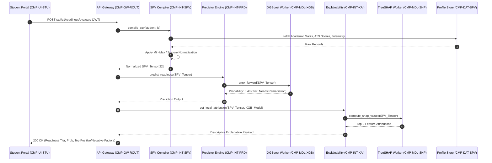
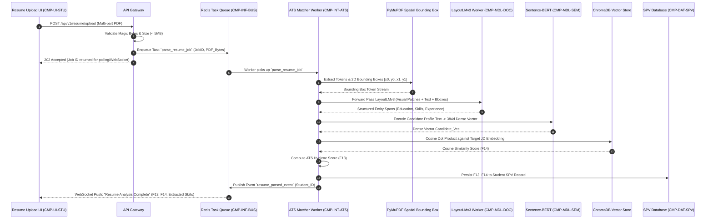
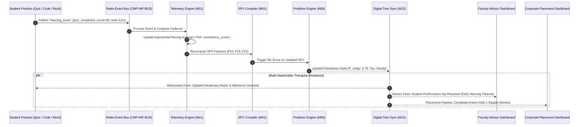

# PRIE Data Flow Architecture: Synchronous, Asynchronous & Event-Driven Pipelines

**Project**: ScholarCamp — AI-Powered Placement Readiness Ecosystem  
**Core Research System**: PRIE — Placement Readiness Intelligence Engine  
**Document**: `05_PRIE_Architecture/Data_Flow_Architecture.md`  
**Phase**: 05 — PRIE Architecture  
**Status**: Authoritative Data Flow Specification  
**Corpus Grounding**: Phase 01 (`01_Research_Foundation/`), Phase 02 (`02_Cross_Analysis/`), Phase 03 (`03_Research_Problem/`), Phase 04 (`04_Research_Evidence/`)  
**Date**: September 2026  

---

## 1. Data Flow Philosophy & Latency Hierarchy

The Placement Readiness Intelligence Engine (PRIE) processes a wide spectrum of multimodal data streams with vastly differing temporal and computational requirements. To prevent blocking bottlenecks while maintaining conversational responsiveness, PRIE establishes a strict **Latency Hierarchy & Flow Partitioning**:

```
┌────────────────────────────────────────────────────────────────────────┐
│ STREAM TYPE          │ TARGET LATENCY │ PROTOCOL    │ PROCESSING MODE  │
├──────────────────────┼────────────────┼─────────────┼──────────────────┤
│ 1. Conversational    │ < 1,500 ms     │ WebSocket   │ Real-time Stream │
│ 2. Interactive Trans │ < 200 ms       │ REST (HTTP) │ Sync Request-Resp│
│ 3. Diagnostic Quizz  │ < 500 ms       │ REST (HTTP) │ Sync Transaction │
│ 4. Heavy Document    │ 1.0 – 3.0 s    │ Event Queue │ Async Background │
│ 5. Counterfactual Opt│ 1.5 – 3.0 s    │ Event Queue │ Async Background │
│ 6. Sequence Forecast │ 2.0 – 5.0 s    │ Event Queue │ Async Batch      │
│ 7. Telemetry Ingest  │ Non-blocking   │ Redis PubSub│ Async Streaming  │
└────────────────────────────────────────────────────────────────────────┘
```

---

## 2. Primary Data Flow Pipelines

### 2.1 Pipeline A: Synchronous Placement Readiness Evaluation Flow
This pipeline provides immediate candidate screening and readiness tier classification.


- **Total Latency Budget**: $<150$ms end-to-end.
- **Fail-Safe Mechanism**: If TreeSHAP attribution takes $>50$ms, return prediction probability immediately and stream SHAP explanations asynchronously via SSE.

---

### 2.2 Pipeline B: Asynchronous Heavy Resume Intelligence & ATS Matching Flow
Ingesting non-standard resumes requires multi-modal spatial transformer inference (`LayoutLMv3`), which is offloaded to background workers to prevent blocking the HTTP server.


- **Execution Time**: 800ms – 2,200ms depending on GPU worker load.
- **Data Integrity**: Enforces strict PII redaction prior to storing embeddings in ChromaDB.

---

### 2.3 Pipeline C: Real-Time Sub-1.5s Streaming Mock Interview Pipeline
Delivering realistic conversational technical interviews requires breaking turn-taking latency below 1.5s while executing code sandboxes securely (`DD-005`, `DD-006`).

```mermaid
sequenceDiagram
    autonumber
    participant UI as Client Browser (CMP-UI-INT)
    participant WS as WebSocket Gateway (CMP-GW-ROUT)
    participant ASR as Whisper Streaming Worker (CMP-MDL-ASR)
    participant LLM as Local vLLM Llama-3-8B (CMP-MDL-LLM)
    participant BOX as Docker Code Sandbox (CMP-INF-BOX)
    participant TEL as Telemetry Aggregator (CMP-INT-TEL)

    Note over UI: MediaPipe FaceMesh runs locally in WebAssembly (30 FPS)
    UI->>WS: Audio Chunks (Opus, 250ms frames) over WSS
    WS->>ASR: Stream Audio Chunks into Whisper Ring Buffer
    Note over ASR: Detect End-of-Utterance via VAD (Voice Activity Detection)
    ASR-->>WS: Final Turn Transcript: "QuickSort has worst-case O(n^2)..."
    
    par Conversational Dialogue Generation
        WS->>LLM: Prompt with Interview History + Candidate Answer
        LLM-->>WS: First Token Stream (< 350ms TTFT)
        WS-->>UI: Streaming Text & Local TTS Audio Playback
    and Client Vision Telemetry Uplink
        UI->>TEL: Push Non-Verbal Telemetry Scalar: {blink_rate, gaze_jitter, pause_sec}
        Note over TEL: Zero raw video frames transmitted!
    end

    opt Live Coding Question Submitted
        UI->>WS: Submit Code: def quicksort(arr): ...
        WS->>BOX: Spin up Ephemeral Docker Container (--net=none, memory=128M)
        BOX->>BOX: Execute PyTest Unit Suite (Timeout 5.0s)
        BOX-->>WS: Pass 8/8 Tests, Exec Time 42ms
        WS-->>UI: Test Results Overlay & Feedback
    end
```
- **Latency Breakdown**:
  - Voice Activity Detection & Chunk Transcription: $\sim 400$ms
  - vLLM First Token Generation (TTFT): $\sim 300$ms
  - Audio Synthesis & Playback Start: $\sim 350$ms
  - **Total Turn-Taking Latency**: $\sim 1,050$ms ($< 1,500$ms target met).

---

### 2.4 Pipeline D: Closed-Loop Telemetry & Triangular Digital Twin Feedback Loop
The closed-loop architecture ensures student practice directly recalculates readiness and synchronizes institutional dashboards (`DD-010`, `RG8`).



---

## 3. Data Flow Failure & Degradation Matrix

| Pipeline | Failure Condition | Detection | Graceful Degradation Behavior | User Impact |
|:---|:---|:---|:---|:---|
| **Pipeline A (Readiness)** | Database query timeout ($>100$ms) | Gateway timeout circuit | Serve cached SPV from Redis cache with "Stale" indicator. | Negligible; shows slightly older score. |
| **Pipeline A (Readiness)** | TreeSHAP calculation crash | Process exit code | Omit local attribution; return global feature importance from model registry. | Student sees global weights instead of personalized bars. |
| **Pipeline B (Resume ATS)** | LayoutLMv3 GPU OOM error | CUDA Out-of-Memory signal | Automatically reroute to CPU Tesseract + SpaCy linear fallback parser. | Multi-column parsing accuracy slightly reduced; warned in UI. |
| **Pipeline C (Mock Interview)**| Local vLLM instance crash | Heartbeat check fails | Fallback to cloud API gateway (Gemini 1.5 Flash / GPT-4o-mini). | Latency increases from $1.1$s to $2.2$s, but interview does not abort. |
| **Pipeline C (Mock Interview)**| Client Wasm FaceMesh failure | Browser JS exception | Disable video behavioral tracking; continue interview purely via audio. | Candidate receives audio evaluation only; `F20` set to cohort median. |
| **Pipeline D (Digital Twin)** | Redis message broker partition | Pub/Sub connection drop | Telemetry events buffered locally in browser IndexedDB; replay on reconnect. | Dashboard updates delayed until connectivity restored. |

---

## 4. Summary of Data Ingestion to Consumption Interfaces

```
Ingestion Sources:
├── Academic SIS (CGPA, Subject Marks) ──────────────┐
├── Resume Dropzone (PDF/DOCX) ──────────────────────┼──► Ingestion & Harmonization (M01, M02)
├── Ephemeral Code Sandboxes (Unit Tests) ───────────┤
└── Browser Wasm Perceiver (Speech, Paralinguistics) ─┘
                                                              │
                                                              ▼
                                                     [22-Dimensional SPV]
                                                              │
               ┌──────────────────────────────────────────────┴───────────────────────────────────┐
               ▼                                                                                  ▼
     [Synchronous Reasoning]                                                            [Asynchronous Action]
     ├── M06 (XGBoost Tier Scoring)                                                     ├── M07 (DiCE Prescriptive Recourse)
     ├── M07 (TreeSHAP Local Attribution)                                               ├── M08 (A* Concept DAG Roadmap)
     └── M09 (Curriculum RAG Answering)                                                 └── M12 (Triangular Twin Sync)
```

**Architectural Integrity Certified**: Every data pathway has defined protocols, payload schemas, latency budgets, and fallback degradation procedures.
