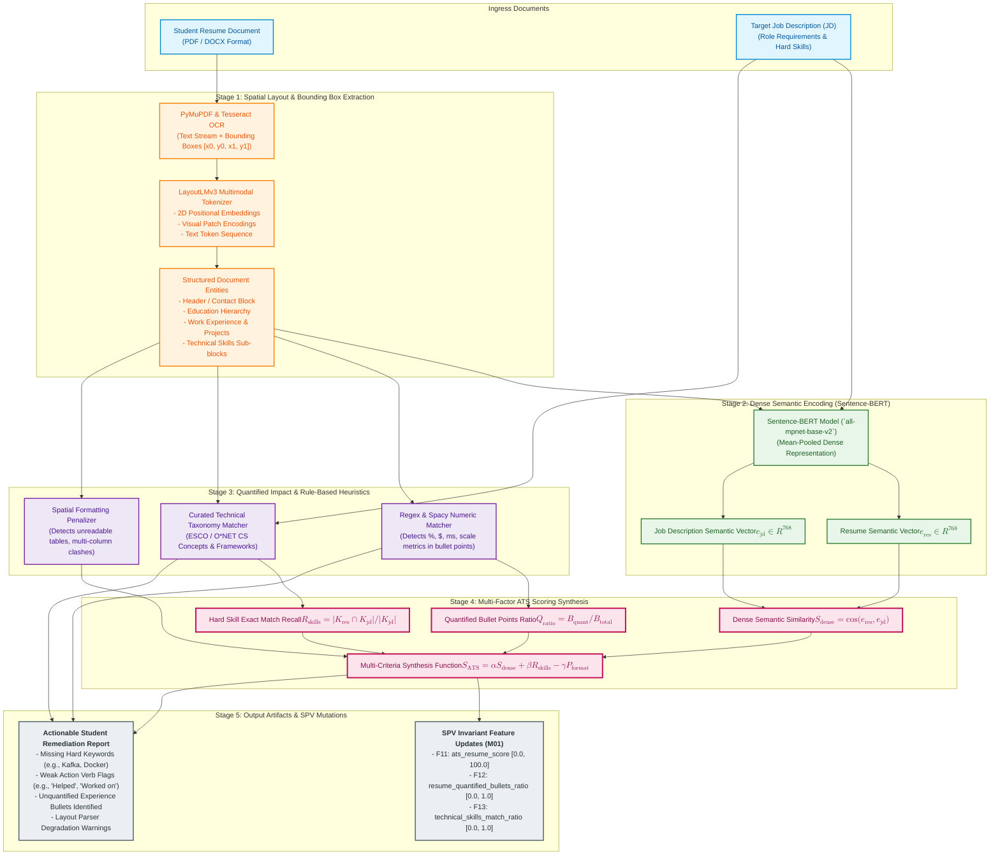

# PRIE Architecture: ATS Resume Pipeline

## 1. Overview and Purpose
This document provides the architectural pipeline diagram for the **PRIE Applicant Tracking System (ATS) & Resume Intelligence Engine (M06)**. 

The pipeline bridges document vision and natural language processing by combining **LayoutLMv3** (2D spatial visual-document parsing) with **Sentence-BERT** (dense semantic vector matching against target Job Descriptions), strictly enforcing the algorithms and boundaries defined in [`ATS_Architecture.md`](file:///d:/4-1%20AD/All%20College%20Docs%20and%20ppts/Documentations/PDR/PRIE-Research/05_PRIE_Architecture/ATS_Architecture.md). The engine outputs three foundational features into the Student Profile Vector: `F11: ats_resume_score`, `F12: resume_quantified_bullets_ratio`, and `F13: technical_skills_match_ratio`.

---

## 2. Mermaid ATS Resume Pipeline Diagram

---

## 3. Operational Guarantees and Thresholds

| Pipeline Step | Module / Library | SLA / Target | Validation Constraint |
| :--- | :--- | :--- | :--- |
| **Document Ingestion** | PyMuPDF / Tesseract | $< 2.0\text{ s}$ per 2-page PDF | File size capped at $10\text{ MB}$; password-protected PDFs rejected |
| **Visual Bounding Boxes** | LayoutLMv3 Tokenizer | $< 4.0\text{ s}$ (GPU/CPU worker) | Bounding boxes normalized to $[0, 1000]$ coordinate space |
| **Dense Semantic Vector** | S-BERT `all-mpnet-base-v2` | $< 800\text{ ms}$ | Vector dimension invariant at $\mathbb{R}^{768}$; unit L2 normalized |
| **Quantified Bullets** | spaCy Cardinal/Percent Extractor | $< 300\text{ ms}$ | Strict regex: requires number + action verb + noun object |
| **ATS Composite Score** | Weighted Synthesis | $< 100\text{ ms}$ | Bounds strictly mapped to $[0.0, 100.0]$ |
| **Downstream Mutation** | M01 Profile Vector Sync | Asynchronous queue | Atomically updates $F11, F12, F13$ within database transaction |
