# PRIE Architecture: Multi-Agent Orchestration Diagram

## 1. Overview and Purpose
This document provides the architectural orchestration diagram for the **PRIE Multi-Agent Supervisory System**. 

Rather than adopting an unconstrained or peer-to-peer agent mesh, PRIE deploys a **hierarchical supervisor pattern** (`AGT-00` Supervising `AGT-01` through `AGT-07`) strictly defined in [`Multi_Agent_Orchestration.md`](file:///d:/4-1%20AD/All%20College%20Docs%20and%20ppts/Documentations/PDR/PRIE-Research/05_PRIE_Architecture/Multi_Agent_Orchestration.md). This diagram illustrates task delegation, tool execution boundaries, permission enforcement, and the **Profile Mutation Gate**, which strictly prohibits autonomous agents from writing directly to the student's authoritative SPV ledger without schema validation.

---

## 2. Mermaid Multi-Agent Orchestration Diagram

```mermaid
flowchart TD
    %% Styling
    classDef supervisor fill:#fff3e0,stroke:#f57c00,stroke-width:3px,color:#e65100;
    classDef workerAgent fill:#e1f5fe,stroke:#0288d1,stroke-width:2px,color:#01579b;
    classDef toolBox fill:#e8f5e9,stroke:#2e7d32,stroke-width:2px,color:#1b5e20;
    classDef gateKeeper fill:#fce4ec,stroke:#c2185b,stroke-width:3px,color:#880e4f;
    classDef storage fill:#eceff1,stroke:#455a64,stroke-width:2px,color:#263238;

    %% Ingress Trigger
    IN_REQ["Client Request / Event Dispatcher<br/>(e.g., 'Update Profile & Generate Remediation Plan')"] --> AGT_00

    %% Central Supervisor Agent
    subgraph SUPERVISORY_CORE ["Supervisory Tier (Hierarchical Controller)"]
        AGT_00["<b>AGT-00: Master Orchestrator Agent</b><br/>- Task Decomposition & Routing<br/>- Agent State Machine & Conversation Context<br/>- Global Timeout & Failure Recovery Manager<br/>- Deterministic Profile Update Validator"]:::supervisor
    end

    %% Specialized Domain Agents
    subgraph SPECIALIZED_AGENTS ["Subordinate Domain Agents (Layer 3 Intelligence)"]
        AGT_01["<b>AGT-01: Profile Agent</b><br/>(Manages M01 & M10 signals)"]:::workerAgent
        AGT_02["<b>AGT-02: Prediction Agent</b><br/>(Manages M03 ONNX inference)"]:::workerAgent
        AGT_03["<b>AGT-03: XAI Agent</b><br/>(Manages M04 SHAP & DiCE)"]:::workerAgent
        AGT_04["<b>AGT-04: Resume Agent</b><br/>(Manages M06 LayoutLM & SBERT)"]:::workerAgent
        AGT_05["<b>AGT-05: Interview Agent</b><br/>(Manages M05 Whisper & vLLM)"]:::workerAgent
        AGT_06["<b>AGT-06: Recommendation Agent</b><br/>(Manages M07 A* & M08 Roadmap)"]:::workerAgent
        AGT_07["<b>AGT-07: Assessment Agent</b><br/>(Manages M09 RAG & M12 AQG)"]:::workerAgent
    end

    %% Bound Microservice Tools & Models
    subgraph TOOLS_TIER ["Deterministic Tool Execution Layer"]
        TOOL_SPV["Tool: SPV Aggregator"]:::toolBox
        TOOL_ONNX["Tool: ONNX XGBoost Engine"]:::toolBox
        TOOL_SHAP["Tool: TreeSHAP / DiCE Worker"]:::toolBox
        TOOL_DOC["Tool: LayoutLMv3 Parser"]:::toolBox
        TOOL_VOICE["Tool: Whisper / FastTTS"]:::toolBox
        TOOL_DAG["Tool: Concept DAG Traversal"]:::toolBox
        TOOL_RAG["Tool: ChromaDB Vector Retr."]:::toolBox
    end

    %% Profile Mutation Safety Gate
    subgraph GOVERNANCE_GATE ["Governance & Safety Barrier"]
        GATE_VALIDATOR["<b>Deterministic Profile Mutation Gate</b><br/>- Schema Validator (F01-F22)<br/>- Numerical Range & Outlier Clipping<br/>- RBAC & Digital Signature Check<br/><i>(Rejects ungrounded or hallucinated mutations)</i>"]:::gateKeeper
    end

    %% Authoritative Storage
    subgraph AUTHORITATIVE_DB ["Authoritative State Ledger"]
        DB_POSTGRES[("PostgreSQL 16 Authoritative Ledger<br/>- Immutable SPV Snapshots<br/>- Audit Trails & Agent Decisions")]:::storage
    end

    %% Supervisor Delegation to Subordinate Agents
    AGT_00 -->|"Delegate: Gather Signals"| AGT_01
    AGT_00 -->|"Delegate: Predict Tier"| AGT_02
    AGT_00 -->|"Delegate: Explain Predictions"| AGT_03
    AGT_00 -->|"Delegate: Parse Resume"| AGT_04
    AGT_00 -->|"Delegate: Conduct Interview"| AGT_05
    AGT_00 -->|"Delegate: Plan Learning"| AGT_06
    AGT_00 -->|"Delegate: Generate Quiz"| AGT_07

    %% Domain Agents to Tool Execution
    AGT_01 --> TOOL_SPV
    AGT_02 --> TOOL_ONNX
    AGT_03 --> TOOL_SHAP
    AGT_04 --> TOOL_DOC
    AGT_05 --> TOOL_VOICE
    AGT_06 --> TOOL_DAG
    AGT_07 --> TOOL_RAG

    %% Return Results to Supervisor
    TOOL_SPV --> AGT_01
    TOOL_ONNX --> AGT_02
    TOOL_SHAP --> AGT_03
    TOOL_DOC --> AGT_04
    TOOL_VOICE --> AGT_05
    TOOL_DAG --> AGT_06
    TOOL_RAG --> AGT_07

    AGT_01 -->|"Feature Proposal Payload"| AGT_00
    AGT_02 -->|"Inference Summary"| AGT_00
    AGT_03 -->|"Attribution & Recourse Paths"| AGT_00
    AGT_04 -->|"Resume Metrics (F11-F13)"| AGT_00
    AGT_05 -->|"Interview Metrics (F14-F17)"| AGT_00
    AGT_06 -->|"Weekly Roadmap Plan"| AGT_00
    AGT_07 -->|"Curated Assessment Set"| AGT_00

    %% Supervisor Commit via Safety Gate
    AGT_00 -->|"Submit Mutation Proposal"| GATE_VALIDATOR
    GATE_VALIDATOR -->|"Validation PASS: Commit Mutation"| DB_POSTGRES
    GATE_VALIDATOR -.->|"Validation FAIL: Alert & Reject"| AGT_00
```

---

## 3. Agent Governance Rules and Authority Boundaries

| Agent ID | Agent Role | Max Execution Timeout | Tool Invocations Permitted | Direct SPV Database Write? |
| :--- | :--- | :--- | :--- | :--- |
| **AGT-00** | Master Supervisor | $15.0\text{ s}$ | Can dispatch all subordinate agents | **YES** (Via Mutation Gate only) |
| **AGT-01** | Profile Manager | $3.0\text{ s}$ | SPV Aggregator, SIS Sync | **NO** (Proposes updates to AGT-00) |
| **AGT-02** | Placement Predictor | $1.0\text{ s}$ | ONNX Runtime, TFT Inference | **NO** (Read-only SPV access) |
| **AGT-03** | Explainability Agent | $5.0\text{ s}$ | TreeSHAP Engine, DiCE Solver | **NO** (Read-only model access) |
| **AGT-04** | Resume Analyst | $10.0\text{ s}$ | PyMuPDF, LayoutLMv3, S-BERT | **NO** (Proposes F11-F13 to AGT-00) |
| **AGT-05** | Mock Interviewer | $1.5\text{ s}$ (turn) | Whisper, vLLM, FastTTS, gVisor | **NO** (Proposes F14-F17 to AGT-00) |
| **AGT-06** | Learning Recommender | $4.0\text{ s}$ | DAG Traversal, Roadmap Compiler | **NO** (Read-only SPV access) |
| **AGT-07** | Assessment Generator | $6.0\text{ s}$ | ChromaDB RAG, AQG Distractor | **NO** (Read-only concept access) |
