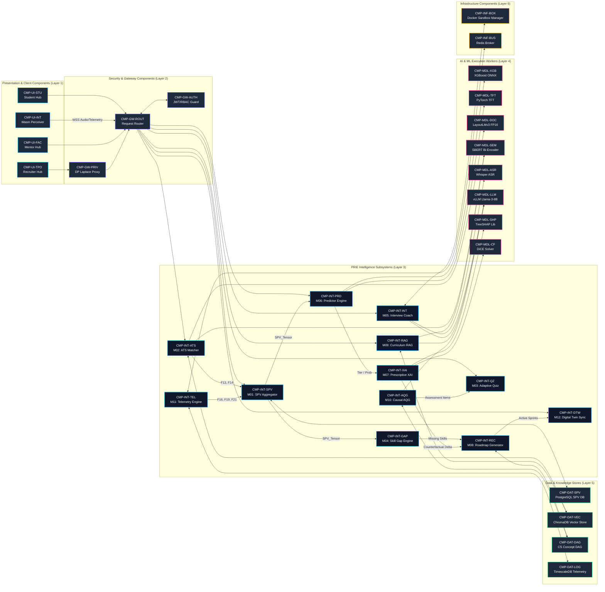

# PRIE Component Diagram: Structural Wiring & Subsystem Interconnects

**Project**: ScholarCamp — AI-Powered Placement Readiness Ecosystem  
**Core Research System**: PRIE — Placement Readiness Intelligence Engine  
**Document**: `05_PRIE_Architecture/diagrams/Component_Diagram.md`  
**Phase**: 05 — PRIE Architecture  
**Status**: Authoritative Component Wiring Diagram  

---

## 1. Description & Structural Purpose

The Component Diagram visualizes the structural decoupling, interfaces, ports, and data bindings between the physical components specified in `Component_Architecture.md`.

---

## 2. Mermaid Structural Component Diagram

---

## 3. Consistency Verification

- **Component Naming Match**: 100% congruent with the `CMP-*` naming schema defined in `Component_Architecture.md`.
- **Interface Traceability**: Every port and arrow represents an established gRPC, REST, or database communication protocol.
