# PRIE Architecture: Data Flow Diagram

## 1. Overview and Purpose
This document presents the detailed architectural Data Flow Diagram (DFD) for the **Placement Readiness Intelligence Engine (PRIE)**. It models how information originates from user interactions, passes through network ingress boundaries, routes across synchronous, streaming, and asynchronous execution tiers, interacts with persistence engines, and delivers actionable intelligence back to students and institutional stakeholders.

All data flows strictly adhere to the latency budgets, operational boundaries, and security constraints defined in [`Data_Flow_Architecture.md`](file:///d:/4-1%20AD/All%20College%20Docs%20and%20ppts/Documentations/PDR/PRIE-Research/05_PRIE_Architecture/Data_Flow_Architecture.md) and [`Architecture_Decision_Records.md`](file:///d:/4-1%20AD/All%20College%20Docs%20and%20ppts/Documentations/PDR/PRIE-Research/05_PRIE_Architecture/Architecture_Decision_Records.md).

---

## 2. Mermaid Data Flow Architecture

```mermaid
flowchart TD
    %% Styling and Classes
    classDef client fill:#e1f5fe,stroke:#0288d1,stroke-width:2px,color:#01579b;
    classDef ingress fill:#fff3e0,stroke:#f57c00,stroke-width:2px,color:#e65100;
    classDef syncService fill:#e8f5e9,stroke:#388e3c,stroke-width:2px,color:#1b5e20;
    classDef streamService fill:#ede7f6,stroke:#7b1fa2,stroke-width:2px,color:#4a148c;
    classDef asyncWorker fill:#fbe9e7,stroke:#d84315,stroke-width:2px,color:#bf360c;
    classDef storage fill:#eceff1,stroke:#455a64,stroke-width:2px,color:#263238;

    %% Subgraph: Clients & Sensors
    subgraph S_CLIENTS ["Client Interaction Tier (Layer 1)"]
        UI_STUDENT["Student Web Application<br/>(React / Next.js)"]:::client
        UI_DASH["Institutional & Recruiter Dashboard"]:::client
        SENSOR_WASM["Browser MediaPipe WebAssembly<br/>(Visual Landmark Extraction)"]:::client
        AUDIO_MIC["Browser WebAudio API<br/>(Opus Mic Stream)"]:::client
    end

    %% Subgraph: Ingress & Orchestration
    subgraph S_INGRESS ["API Ingress Tier (Layer 2)"]
        APIGW["FastAPI Ingress Gateway<br/>(Rate Limiter, JWT Auth, CORS)"]:::ingress
        WSS_GW["WebSocket Ingress Server<br/>(Duplex Audio/Text Session)"]:::ingress
        BROKER["Event Broker & Task Queue<br/>(RabbitMQ / Redis Streams)"]:::ingress
    end

    %% Subgraph: Synchronous Services (SLA < 150ms)
    subgraph S_SYNC ["Synchronous Intelligence Services (Layer 3)"]
        SVC_PROFILE["M01 Profile Ingestion & SPV Aggregator"]:::syncService
        SVC_PRED["M03 Placement Prediction Engine<br/>(ONNX Runtime: XGBoost)"]:::syncService
        SVC_REC["M07 Recommendation Engine<br/>(A* DAG Search)"]:::syncService
        SVC_RAG["M09 RAG Query Service<br/>(ChromaDB Retr. + Cross-Enc)"]:::syncService
    end

    %% Subgraph: Streaming Services (SLA < 1.5s)
    subgraph S_STREAM ["Real-Time Streaming Services (Layer 3)"]
        SVC_VAD["M05 Silero VAD / Chunk Buffer<br/>(200ms audio chunks)"]:::streamService
        SVC_STT["M05 Chunk Whisper STT<br/>(Batched Tokenizer)"]:::streamService
        SVC_SLM["M05 Local vLLM Inference<br/>(Qwen2.5-7B-Instruct Engine)"]:::streamService
        SVC_TTS["M05 FastTTS Audio Generator<br/>(Streaming PCM Response)"]:::streamService
    end

    %% Subgraph: Asynchronous Execution Workers
    subgraph S_ASYNC ["Asynchronous Processing Workers (Layer 3/6)"]
        WRK_RESUME["M06 ATS Document Worker<br/>(LayoutLMv3 BBox + S-BERT)"]:::asyncWorker
        WRK_DICE["M04 DiCE Counterfactual Worker<br/>(Loss Optimization Recourse)"]:::asyncWorker
        WRK_SHAP["M04 TreeSHAP Feature Attributor<br/>(Exact Tree Path Traversal)"]:::asyncWorker
        WRK_TEL["M10 Telemetry Ingestion Worker<br/>(Clickstream Aggregation)"]:::asyncWorker
        WRK_TWIN["M11 Digital Twin Sync Worker<br/>(Longitudinal State Drift)"]:::asyncWorker
        WRK_DOCKER["M05 Sandbox Code Evaluator<br/>(Isolated gVisor Container)"]:::asyncWorker
    end

    %% Subgraph: Data Persistence Tier
    subgraph S_DATA ["Data Tier (Layer 5)"]
        DB_POSTGRES[("PostgreSQL 16 Relational<br/>- Student Records<br/>- SPV Vectors (F01-F22)<br/>- Roadmaps & Audits")]:::storage
        DB_VECTOR[("ChromaDB Vector Store<br/>- Concept Knowledge Chunks<br/>- Resume / Job Embeddings")]:::storage
        DB_TIMESERIES[("TimescaleDB Timeseries<br/>- Behavioral Telemetry<br/>- Weekly Engagement Rollups")]:::storage
        FS_S3[("S3 / MinIO Object Storage<br/>- PDF Resumes<br/>- Encrypted Audio Blobs")]:::storage
        CACHE_REDIS[("Redis Cache Cluster<br/>- Session Tokens<br/>- Pre-computed SPV & Recs")]:::storage
    end

    %% Data Flow Connections: Synchronous Path
    UI_STUDENT -->|"HTTPS: REST Request (Profile / Recs)"| APIGW
    UI_DASH -->|"HTTPS: Analytical Query"| APIGW
    APIGW -->|"Validate Token & Route"| SVC_PROFILE
    APIGW -->|"Fetch Current SPV & Predict"| SVC_PRED
    APIGW -->|"Request Optimal Next Milestone"| SVC_REC
    APIGW -->|"Domain Concept Query"| SVC_RAG

    SVC_PROFILE <-->|"Read / Write Student Records"| DB_POSTGRES
    SVC_PROFILE <-->|"Get / Cache SPV Tensor"| CACHE_REDIS
    SVC_PRED <-->|"Read Scaled SPV Tensor"| CACHE_REDIS
    SVC_PRED -->|"Return Probability & Tier"| APIGW
    SVC_REC <-->|"Read DAG Graph & Gaps"| CACHE_REDIS
    SVC_REC -->|"Return Ranked Milestones"| APIGW
    SVC_RAG <-->|"Dense Cosine Retrieval"| DB_VECTOR
    SVC_RAG -->|"Return Grounded Context"| APIGW
    APIGW -->|"HTTPS: JSON Payload (<150ms)"| UI_STUDENT

    %% Data Flow Connections: Streaming Path
    AUDIO_MIC -->|"WSS: Binary Opus Audio Chunks"| WSS_GW
    SENSOR_WASM -->|"WSS: Extracted Visual Features (Blinks/Gaze)"| WSS_GW
    WSS_GW -->|"Stream Chunks"| SVC_VAD
    SVC_VAD -->|"Speech Boundaries Detected"| SVC_STT
    SVC_STT -->|"Incremental Tokens"| SVC_SLM
    SVC_SLM -->|"Generated Response Tokens"| SVC_TTS
    SVC_TTS -->|"Streaming PCM Audio Chunks"| WSS_GW
    WSS_GW -->|"WSS: Audio Stream Playback (<1.5s SLA)"| UI_STUDENT

    %% Data Flow Connections: Asynchronous Enqueueing
    APIGW -->|"POST: Resume Upload Event"| BROKER
    APIGW -->|"Trigger Explanation Event"| BROKER
    UI_STUDENT -->|"HTTP: Code Execution Event"| BROKER
    UI_STUDENT -->|"HTTP: Behavioral Clickstream Beacon"| BROKER
    WSS_GW -->|"Session Complete Event"| BROKER

    %% Broker to Workers
    BROKER -->|"Task: Parse Resume PDF"| WRK_RESUME
    BROKER -->|"Task: Run DiCE Optimization"| WRK_DICE
    BROKER -->|"Task: Calculate SHAP Values"| WRK_SHAP
    BROKER -->|"Task: Ingest Clickstream Log"| WRK_TEL
    BROKER -->|"Task: Execute Untrusted Code"| WRK_DOCKER
    BROKER -->|"Task: Sync Student State"| WRK_TWIN

    %% Worker Persistence
    WRK_RESUME <-->|"Fetch Raw PDF / Save Bounding Boxes"| FS_S3
    WRK_RESUME -->|"Write Resume Semantic Embeddings"| DB_VECTOR
    WRK_RESUME -->|"Update ATS Match Score"| DB_POSTGRES
    WRK_DICE -->|"Write Actionable Recourse Prescriptions"| DB_POSTGRES
    WRK_SHAP -->|"Write Local SHAP Attribution Values"| DB_POSTGRES
    WRK_DOCKER -->|"Return Sandboxed Execution Verdict"| DB_POSTGRES
    WRK_TEL -->|"Write High-Volume Events"| DB_TIMESERIES
    WRK_TWIN <-->|"Read Profile & Roadmap History"| DB_POSTGRES
    WRK_TWIN -->|"Push Updated State / Projections"| CACHE_REDIS
```

---

## 3. Flow Classification and Operational Guarantees

| Flow Identifier | Channel / Protocol | Ingress Target | Execution Type | Latency Guarantee | Security / Isolation Boundary |
| :--- | :--- | :--- | :--- | :--- | :--- |
| **DF-SYNC-01** | HTTPS / TLS 1.3 | FastAPI Gateway | Synchronous (Worker Pool) | $< 150\text{ ms}$ | JWT Authentication, Scoped RBAC, Input Validation |
| **DF-STREAM-01** | WSS / TLS 1.3 | WebSocket Gateway | Streaming Pipeline | $< 1,500\text{ ms}$ (TTFT + TTS) | Ephemeral Session Secret, Zero Audio Retention |
| **DF-STREAM-02** | WSS / TLS 1.3 | WebSocket Gateway | Client-Side Sensory Feed | Real-time ($30\text{ Hz}$) | WebAssembly Client Sandbox, Feature Tensors Only |
| **DF-ASYNC-01** | AMQP / RabbitMQ | Celery Worker Queue | Asynchronous Worker | $< 10.0\text{ s}$ | MinIO Signed URLs, Strict Memory/CPU Cgroups |
| **DF-ASYNC-02** | AMQP / RabbitMQ | gVisor Sandbox Daemon | Asynchronous Worker | $< 5.0\text{ s}$ | PTRACE Sandbox, Network Isolation, No Root Host Access |
| **DF-ASYNC-03** | AMQP / RabbitMQ | Background Batch Queue | Asynchronous Worker | $< 2.0\text{ s}$ | Internal IPC Only, Rate-Limited Database Pool |

---

## 4. Traceability to Research Evidence and Design Decisions

- **DD-005 (Interview Latency & Privacy)**: Audio processed in 200ms streaming chunks; vision processed client-side via MediaPipe Wasm.
- **DD-002 (Two-Tiered Explainability)**: Global/Local TreeSHAP and DiCE counterfactual optimization are decoupled from synchronous prediction and handled asynchronously via background workers.
- **DD-003 (2D Spatial ATS Parsing)**: PDF parsing with LayoutLMv3 and Sentence-BERT occurs via `WRK_RESUME` asynchronously without blocking HTTP client threads.
- **DD-009 (Real-Time Behavioral Analytics)**: Clickstream telemetry routes directly to TimescaleDB via lightweight async ingest buffers to preserve relational DB write capacity.
