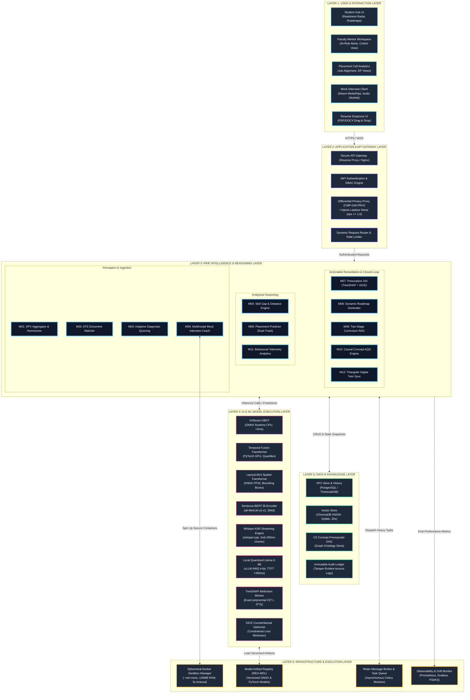

# PRIE High-Level Architecture Diagram: 6-Layer Hierarchical System Design

**Project**: ScholarCamp — AI-Powered Placement Readiness Ecosystem  
**Core Research System**: PRIE — Placement Readiness Intelligence Engine  
**Document**: `05_PRIE_Architecture/diagrams/High_Level_Architecture.md`  
**Phase**: 05 — PRIE Architecture  
**Status**: Authoritative High-Level Architecture Diagram  

---

## 1. Description & Structural Overview

This diagram formalizes the 6-layer decoupled architecture of PRIE, depicting the downward flow of user requests and data ingestion, horizontal interactions between intelligence components, and persistent interactions with models, data, and infrastructure.

---

## 2. Mermaid 6-Layer Architecture Blueprint

---

## 3. Consistency Verification

- **Layer Completeness**: All 6 architectural layers codified in `System_Architecture.md` are represented.
- **Module Coverage**: All twelve modules (`M01` through `M12`) are positioned within Layer 3.
- **Model Isolation**: Layer 4 explicitly isolates all 8 model execution workers.
- **Infrastructure Alignment**: Layer 6 models the ephemeral Docker sandboxes (`DD-006`), Redis broker, model registry, and observability stack.
