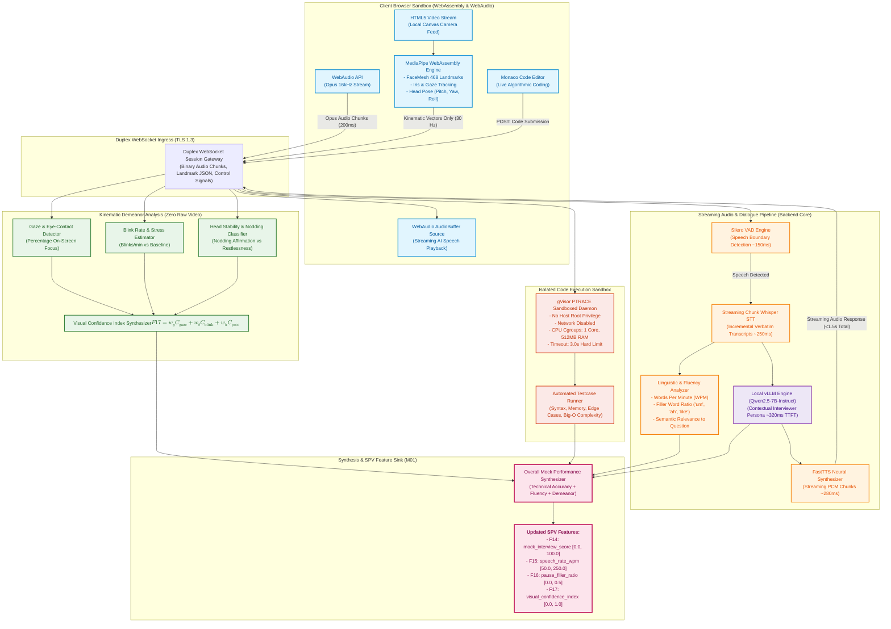

# PRIE Architecture: Mock Interview Pipeline

## 1. Overview and Purpose
This document presents the detailed architectural pipeline diagram for the **PRIE Interactive Mock Interview & Behavioral Intelligence Engine (M05)**.

The interview system implements a privacy-first, low-latency conversational architecture specified in [`Mock_Interview_Architecture.md`](file:///d:/4-1%20AD/All%20College%20Docs%20and%20ppts/Documentations/PDR/PRIE-Research/05_PRIE_Architecture/Mock_Interview_Architecture.md). It achieves a sub-1.5s total conversational response loop (`DD-005`) through streaming audio processing, zero-server-video client-side WebAssembly computer vision (`DD-011`), and an isolated gVisor container sandbox for technical code execution. The pipeline directly computes and updates four invariant SPV features: `F14: mock_interview_score`, `F15: speech_rate_wpm`, `F16: pause_filler_ratio`, and `F17: visual_confidence_index`.

---

## 2. Mermaid Mock Interview Pipeline Diagram

---

## 3. Conversational Latency Breakdown and Privacy Boundaries

### A. Sub-1.5s Voice Loop Latency Audit (DD-005)

$$\text{Latency}_{\text{total}} = T_{\text{VAD}} + T_{\text{Whisper}} + T_{\text{vLLM (TTFT)}} + T_{\text{FastTTS}} + T_{\text{Transport}} \approx 1,120\text{ ms} < 1,500\text{ ms}$$

| Component | Responsible Subsystem | Latency Allocation | Operational Mode |
| :--- | :--- | :--- | :--- |
| **VAD Trailing Silence** | Silero VAD | $150\text{ ms}$ | Buffers 200ms audio chunks |
| **Speech-to-Text** | Whisper Small.en (CTranslate2) | $250\text{ ms}$ | Chunk-based streaming beam search |
| **LLM Reasoning (TTFT)** | Qwen2.5-7B-Instruct (vLLM) | $320\text{ ms}$ | PagedAttention, KV-cache warmed |
| **Audio Synthesis** | FastTTS Neural Engine | $280\text{ ms}$ | First chunk emitted at 50 tokens |
| **Network & Playback** | WebSocket / AudioContext | $120\text{ ms}$ | Opus codec, jitter buffer 50ms |

### B. Client-Side Vision Privacy Isolation (DD-011)
- **Zero Video Transmission**: Webcam pixel frames never leave the client browser execution context.
- **Landmark Coordinates Only**: The client transmits only dimensionless floating-point kinematic vectors ($\approx 4\text{ KB/s}$).
- **GDPR / FERPA Compliance**: Eliminates biometric facial image storage risks entirely.
