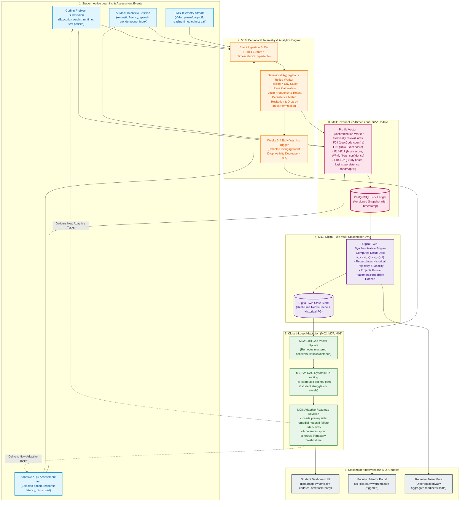

# PRIE Architecture: Learning Feedback Loop

## 1. Overview and Purpose
This document presents the detailed architectural diagram for the **PRIE Adaptive Learning Feedback Loop**.

A central limitation of existing placement prediction systems identified in `RG1` and `RG4` is their static, one-way nature: predictions are treated as immutable endpoints without continuous feedback. PRIE resolves this by establishing a **closed-loop continuous synchronization architecture** connecting student learning activity, behavioral telemetry (M10), SPV feature updates (M01), multi-stakeholder Digital Twin state synchronization (M11), and automated curricular adaptation (M07, M08).

---

## 2. Mermaid Learning Feedback Loop Diagram

---

## 3. Feedback Loop Invariants and Performance Gates

| Loop Component | Triggering Frequency | Execution SLA | Mutated State Entities |
| :--- | :--- | :--- | :--- |
| **Instant Score Updates** | Immediate upon test/code submit | $< 1.0\text{ s}$ | $F04, F06, F14$ raw scores in session cache |
| **Behavioral Rollup** | Hourly micro-batch | $< 15.0\text{ s}$ | $F18$ (Hours), $F19$ (Frequency), $F21$ (Hesitation) |
| **Twin Trajectory Sync** | Daily at 00:00 UTC (or post-session) | $< 2.0\text{ s}$ | Digital Twin historical velocity, 90-day projection |
| **Curricular Re-planning** | Upon milestone failure / completion | $< 500\text{ ms}$ | Weekly Roadmap task sequence, prerequisite injections |
| **Early Warning Escalation** | Continuous threshold check | $< 100\text{ ms}$ | Mentor notification queue (Weeks 3–4 dropout prevention) |
