# PRIE Architecture: Model Serving Diagram

## 1. Overview and Purpose
This document presents the detailed architectural diagram for the **PRIE Model Serving & Inference Infrastructure (Layer 4 & Layer 6)**.

The serving architecture translates the specifications from [`Model_Serving_Architecture.md`](file:///d:/4-1%20AD/All%20College%20Docs%20and%20ppts/Documentations/PDR/PRIE-Research/05_PRIE_Architecture/Model_Serving_Architecture.md) into concrete physical execution tiers. It decouples lightweight, millisecond-critical CPU tabular inference (ONNX Runtime) from specialized GPU transformer workers (vLLM, LayoutLMv3, Whisper) to optimize resource allocation, prevent head-of-line blocking, and enforce strict SLA boundaries across all machine learning modules.

---

## 2. Mermaid Model Serving Architecture Diagram

```mermaid
flowchart TD
    %% Styling
    classDef registry fill:#fff3e0,stroke:#f57c00,stroke-width:2px,color:#e65100;
    classDef cpuTier fill:#e8f5e9,stroke:#2e7d32,stroke-width:2px,color:#1b5e20;
    classDef gpuTier fill:#e1f5fe,stroke:#0288d1,stroke-width:2px,color:#01579b;
    classDef llmTier fill:#ede7f6,stroke:#7b1fa2,stroke-width:3px,color:#4a148c;
    classDef obsTier fill:#fbe9e7,stroke:#d84315,stroke-width:2px,color:#bf360c;
    classDef clientGateway fill:#eceff1,stroke:#455a64,stroke-width:2px,color:#263238;

    %% Ingress & Load Balancing
    subgraph INGRESS_ROUTER ["Model Routing & Gateway Layer"]
        MODEL_ROUTER["PRIE Internal Model Gateway<br/>(gRPC / HTTP/2 Load Balancer)"]:::clientGateway
    end

    %% Model Registry & Artifact Store
    subgraph REGISTRY_LAYER ["Model Governance & Registry (MLflow / MinIO)"]
        REG_STORE[("Model Registry Bucket<br/>- SHA-256 Checksum Validation<br/>- Versioned Artifacts: `.onnx`, `.pt`, `safetensors`<br/>- Hyperparameters & Validation Logs")]:::registry
        STAGE_PROD["Production Tag: `prie-prod-v1.2`"]:::registry
    end

    %% Tier 1: High-Speed CPU Inference (SLA < 50ms)
    subgraph TIER_CPU ["Tier 1: Tabular & Attribution Engine (ONNX CPU Runtime)"]
        ONNX_WORKER_1["ONNX Worker Pool (4 Pods)<br/>2 vCPU, 4GB RAM per Pod"]:::cpuTier
        MOD_XGB_ONNX["M03: XGBoost Classifier<br/>(`prie_xgboost_v1.onnx`)"]:::cpuTier
        MOD_SHAP_FAST["M04: Fast TreeSHAP Kernel<br/>(C++ Interop Traversal)"]:::cpuTier
        MOD_CALIB["M03: Isotonic Calibrator<br/>(Empirical Probability Mapping)"]:::cpuTier
    end

    %% Tier 2: Embedding & Vision Transformer Workers (GPU Worker Pool)
    subgraph TIER_TRANSFORMERS ["Tier 2: Dense Encoders & Temporal Workers (PyTorch / GPU)"]
        GPU_WORKER_POOL["GPU Worker Pool (2 Pods)<br/>1x NVIDIA T4 / A10G per Pod"]:::gpuTier
        MOD_SBERT["M06/M09: Sentence-BERT<br/>(`all-mpnet-base-v2` TorchScript)"]:::gpuTier
        MOD_LAYOUT["M06: LayoutLMv3 Tokenizer<br/>(Spatial Visual-Text Engine)"]:::gpuTier
        MOD_TFT["M03: Temporal Fusion Transformer<br/>(Quantile Multi-horizon Forecaster)"]:::gpuTier
    end

    %% Tier 3: Real-Time Generative & Speech Inference
    subgraph TIER_GENAI ["Tier 3: Dialogue & Speech Serving (vLLM Engine)"]
        VLLM_ENGINE["vLLM Serving Container<br/>- PagedAttention KV-Cache<br/>- Dynamic Request Batching<br/>- FP16 Tensor Parallelism"]:::llmTier
        MOD_QWEN["M05/M12: Qwen2.5-7B-Instruct<br/>(Technical Interviewer & AQG)"]:::llmTier
        WHISPER_CT2["M05: Streaming Whisper STT<br/>(CTranslate2 Optimized INT8 Engine)"]:::llmTier
        FAST_TTS["M05: FastTTS Synthesizer<br/>(Low-latency Neural Speech Engine)"]:::llmTier
    end

    %% Model Observability, Drift & Telemetry
    subgraph TIER_MONITORING ["Model Observability & Drift Monitoring"]
        PROM_EXPORTER["Prometheus Metrics Exporter<br/>- Latency (p50, p95, p99)<br/>- Throughput (RPS)<br/>- Memory / GPU Saturation"]:::obsTier
        DRIFT_EVAL["Evidently AI / Drift Detector Worker<br/>- KS-Test on 22 SPV Features<br/>- Population Stability Index (PSI)<br/>- Automated Re-training Trigger Alert"]:::obsTier
    end

    %% Ingress to Tiers
    MODEL_ROUTER -->|"Route: Tabular Placement Pred (Fast Path)"| ONNX_WORKER_1
    MODEL_ROUTER -->|"Route: Resume / Document Embedding"| GPU_WORKER_POOL
    MODEL_ROUTER -->|"Route: Live Interview Dialogue"| VLLM_ENGINE
    MODEL_ROUTER -->|"Route: Speech Audio Chunk"| WHISPER_CT2

    %% Registry Deployment to Tiers
    REG_STORE -->|"Pull Verified Artifact"| ONNX_WORKER_1
    REG_STORE -->|"Pull Verified Artifact"| GPU_WORKER_POOL
    REG_STORE -->|"Pull Verified Weights"| VLLM_ENGINE

    %% Internal Tier Executions
    ONNX_WORKER_1 --> MOD_XGB_ONNX
    MOD_XGB_ONNX --> MOD_CALIB
    ONNX_WORKER_1 --> MOD_SHAP_FAST

    GPU_WORKER_POOL --> MOD_SBERT
    GPU_WORKER_POOL --> MOD_LAYOUT
    GPU_WORKER_POOL --> MOD_TFT

    VLLM_ENGINE --> MOD_QWEN
    VLLM_ENGINE --> FAST_TTS

    %% Observability Connections
    ONNX_WORKER_1 --> PROM_EXPORTER
    GPU_WORKER_POOL --> PROM_EXPORTER
    VLLM_ENGINE --> PROM_EXPORTER
    WHISPER_CT2 --> PROM_EXPORTER

    PROM_EXPORTER --> DRIFT_EVAL
    ONNX_WORKER_1 -.->|"Batch Input Snapshots"| DRIFT_EVAL
```

---

## 3. Serving Tier Specification and Resource Quotas

| Serving Tier | Engine / Framework | Hardware Allocation | Enforced Latency SLA | Target Modules |
| :--- | :--- | :--- | :--- | :--- |
| **Tier 1: Tabular CPU** | ONNX Runtime 1.17 (C++) | 2 Cores, 4GB RAM per worker | $\le 45\text{ ms}$ (p99) | `M03` (XGBoost), `M04` (Fast TreeSHAP) |
| **Tier 2: Heavy GPU** | PyTorch 2.2 / TorchScript | 1x NVIDIA T4 (16GB VRAM) | $\le 800\text{ ms}$ (p95) | `M06` (LayoutLMv3, S-BERT), `M03` (TFT) |
| **Tier 3: GenAI / vLLM**| vLLM 0.6+ (PagedAttention)| 1x NVIDIA A10G (24GB VRAM) | $\le 350\text{ ms}$ (TTFT) | `M05` (Mock Dialogue), `M12` (AQG Engine) |
| **Tier 4: Speech Stream**| CTranslate2 / FastTTS | 4 Cores, 8GB RAM (CPU/GPU) | $\le 250\text{ ms}$ per chunk | `M05` (Whisper Small.en, FastTTS) |
| **Observability** | Prometheus + Evidently AI | 1 Core, 2GB RAM (Async batch)| Off-line evaluation | System metrics & SPV feature drift |
