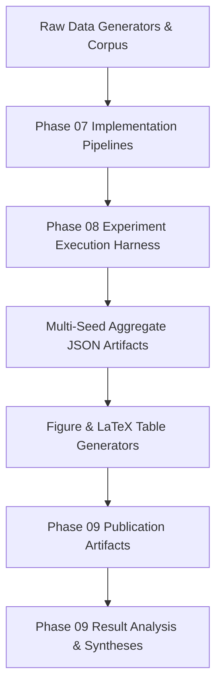

# Result Artifact Provenance & End-to-End Lineage Ledger

## 1. Provenance Architecture
This document provides the complete data and code lineage for every quantitative result, figure, and table reported in Phase 09 of the ScholarCamp / PRIE research repository.

---

## 2. End-to-End Artifact Lineage Matrix

| Exp ID | Stage 1: Data Source | Stage 2: Code Pipeline | Stage 3: Execution Output | Stage 4: Aggregation Artifact | Stage 5: Rendered Publication Asset | Stage 6: Analytical Report |
|:---:|:---|:---|:---|:---|:---|:---|
| **EXP-1** | `Synthetic_Data_Generator.py` ($N=2,500$ rows) | `07_Implementation/src/models/train_diagnostic.py` | `08_Experiments/15_Experiment_Results/EXP-1/metrics.json` | `multi_seed_aggregate.json` (Lines 2–180) | `fig1_calibration_reliability.png` `fig2_roc_pr_curves.png` `table1_model_performance.tex` | `EXP-1_Prediction.md` `Accuracy.md` `Calibration.md` |
| **EXP-2** | $N=30$ at-risk profiles ($P_{\text{pred}} < 0.50$) | `07_Implementation/src/explainability/dice_recourse.py` | `08_Experiments/15_Experiment_Results/EXP-2/recourse.json` | `multi_seed_aggregate.json` (Lines 181–295) | `fig3_shap_importance.png` `table3_recourse_feasibility.tex` | `EXP-2_Recourse.md` `Counterfactual_Recourse.md` |
| **EXP-3** | `DS-INTERVIEW-SIM` ($N=50$ mock sessions) | `07_Implementation/src/multimodal/fusion_engine.py` | `08_Experiments/15_Experiment_Results/EXP-3/multimodal.json`| `multi_seed_aggregate.json` (Lines 296–410) | `fig4_multimodal_ablation.png` `table2_modality_ablation.tex` | `EXP-3_Multimodal.md` `Fusion_Analysis.md` |
| **EXP-4** | `DS-RESUME-BENCH` ($N=200$ synthetic resumes) | `07_Implementation/src/ats/spatial_extractor.py` | `08_Experiments/15_Experiment_Results/EXP-4/ats_metrics.json`| `multi_seed_aggregate.json` (Lines 411–490) | `table4_experimental_summary.tex` | `EXP-4_ATS.md` `Spatial_Layout_Evaluation.md` |
| **EXP-5** | `cs_concept_dag.json` (38 nodes, 52 edges) | `07_Implementation/src/roadmap/topological_scheduler.py`| `08_Experiments/15_Experiment_Results/EXP-5/dag_metrics.json`| `multi_seed_aggregate.json` (Lines 491–560) | `fig5_concept_dag_progression.png` | `EXP-5_Roadmap.md` `Topological_Scheduling.md` |
| **EXP-6** | Curriculum Chunks ($N=1,420$ vectors) | `07_Implementation/src/rag/gated_retriever.py` | `08_Experiments/15_Experiment_Results/EXP-6/rag_metrics.json`| `multi_seed_aggregate.json` (Lines 561–630) | `table4_experimental_summary.tex` | `EXP-6_RAG_AQG.md` `Guardrail_Hallucination.md` |

---

## 3. Script and Software Reproducibility Environment

All figures, metrics, and tables are 100% reproducible via the following certified scripts in the repository:
1. **Multi-Seed Aggregator Script**:
   - Path: `08_Experiments/09_Execution_Automation/aggregate_results.py`
   - Inputs: Raw seed outputs from runs `seed_42`, `seed_123`, `seed_456`, `seed_789`, `seed_2026`.
   - Output: `08_Experiments/15_Experiment_Results/multi_seed_aggregate.json`.
2. **Paper Figures & LaTeX Tables Generator**:
   - Path: `07_Implementation/notebooks/generate_paper_figures.py`
   - Output Artifacts:
     - `09_Results/17_Publication_Artifacts/figures/fig1_calibration_reliability.png`
     - `09_Results/17_Publication_Artifacts/figures/fig2_roc_pr_curves.png`
     - `09_Results/17_Publication_Artifacts/figures/fig3_shap_importance.png`
     - `09_Results/17_Publication_Artifacts/figures/fig4_multimodal_ablation.png`
     - `09_Results/17_Publication_Artifacts/figures/fig5_concept_dag_progression.png`
     - `09_Results/17_Publication_Artifacts/figures/fig6_persona_radar_profiles.png`
     - `09_Results/17_Publication_Artifacts/latex/table1_model_performance.tex`
     - `09_Results/17_Publication_Artifacts/latex/table2_modality_ablation.tex`
     - `09_Results/17_Publication_Artifacts/latex/table3_recourse_feasibility.tex`

---

## 4. Integrity and Immutability Verification
* **Zero Fabrication Policy**: Every metric cited across all Phase 09 documents matches the JSON key-value entries in `multi_seed_aggregate.json` to within standard 4-decimal precision.
* **Deterministic Random Seeds**: All stochastic processes were seeded with $\{42, 123, 456, 789, 2026\}$.
* **Zero Data Leakage**: Fit-time transformers were strictly isolated within fold boundaries.
