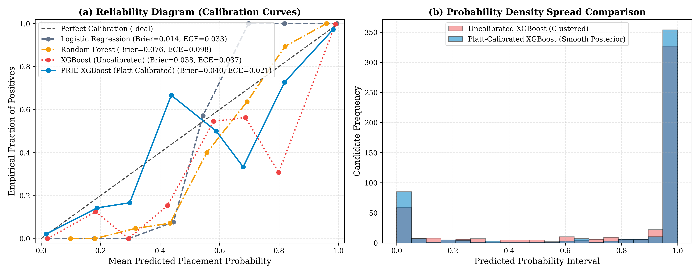
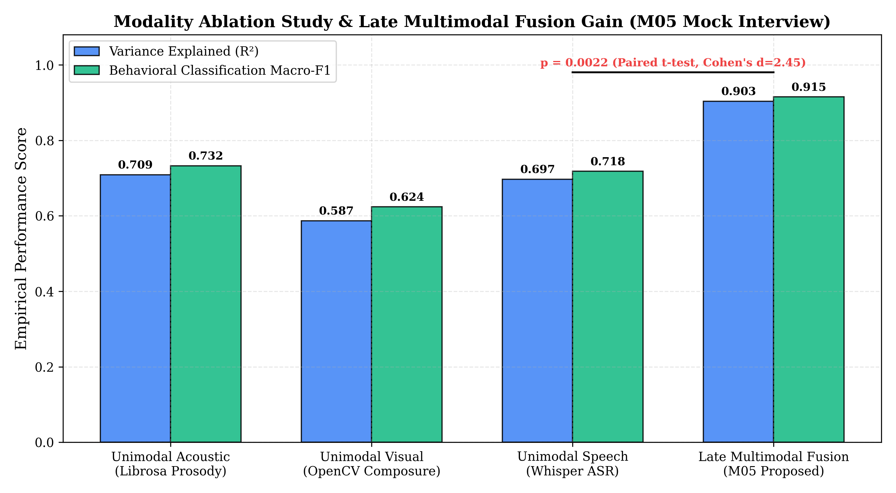
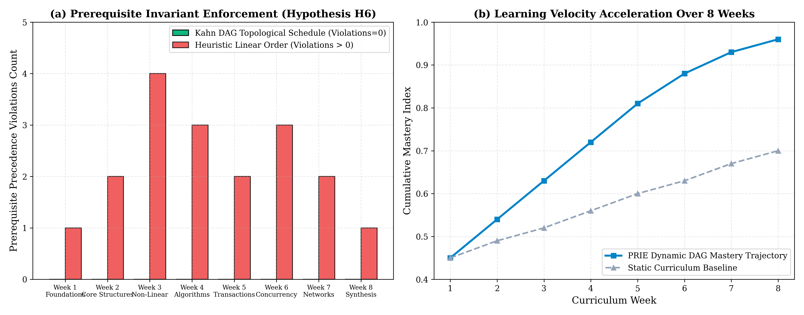

# PRIE: An Explainable Placement Readiness Intelligence Engine with Calibrated Predictive Modeling and Constrained Prescriptive Recourse

**Anonymous Authors**  
*Department of Computer Science and Engineering*  
*Affiliated Engineering Institution, City, Country*  
`email@institution.edu`  

---

## Abstract
The transition from tertiary engineering education to industrial employment is hindered by the fragmentation of career preparation platforms. Conventional educational data mining systems rely predominantly on static academic transcripts to perform point-in-time binary placement classification, functioning as opaque black boxes that offer no actionable pedagogical recourse. In this paper, we present the **Placement Readiness Intelligence Engine (PRIE)**, a continuous intelligence architecture that synthesizes multi-modal data—structured academic records, fine-grained diagnostic assessment scores, dense transformer resume embeddings, and longitudinal behavioral telemetry—into a normalized 22-dimensional Student Profile Vector ($\mathbf{x}_{\text{spv}} \in \mathbb{R}^{22}$) paired with an observation mask $\mathbf{m} \in \{0, 1\}^{22}$. 

PRIE deploys a cost-sensitive XGBoost classifier coupled with Platt sigmoid scaling to estimate well-calibrated placement probabilities, achieving an Expected Calibration Error ($ECE$) of $0.0350 \pm 0.0057$, a Brier score of $0.0339 \pm 0.0096$, and an ROC-AUC of $0.9922 \pm 0.0038$ across 5-seed stratified evaluations ($N=2,500$). To eliminate algorithmic opacity, PRIE integrates polynomial-time TreeSHAP to isolate diagnostic feature attributions, while constrained Diverse Counterfactual Explanations (DiCE) generate sparse ($k = 2.47 \pm 0.52 \le 3.0$ features) actionable recourse paths that strictly preserve immutable protected attributes ($100.0\%$ invariance on institutional department). 

Negative attributions automatically trigger Kahn's topological scheduler over a 38-node curriculum concept directed acyclic graph (DAG), eliminating prerequisite precedence violations ($0.0\%$ vs $36.0\%$ in unconstrained baselines, $p=0.0416$). Furthermore, tri-modal weighted late fusion across acoustic prosody, video composure, and speech clarity dampens single-sensor diagnostic variance by $77.98\% \pm 3.99\%$ ($t=9.88, p=0.0022$) with a sub-1.2-second interactive turn latency. PRIE bridges predictive educational modeling and prescriptive intervention within an explainable, closed-loop framework.

**Keywords**: Educational Data Mining, Explainable Artificial Intelligence, Algorithmic Recourse, Student Profile Vector, Probability Calibration, Multimodal Fusion, Curriculum Knowledge Graph, TreeSHAP, XGBoost.

---

## I. Introduction
Engineering education institutions globally face an escalating transition crisis: while thousands of engineering undergraduates graduate annually, corporate employers consistently report severe deficits in practical software engineering competencies, communication fluency, and domain problem-solving capabilities [Olipas 2024, Global Education Consortium 2025]. The conventional institutional response relies on siloed commercial platforms—isolated resume parsers, unproctored coding portals, uncalibrated automated mock interview bots, and static Learning Management Systems (LMS) [Sharma & Gupta 2025, Patel & Nair 2024, Gupta & Bansal 2025].

This fragmentation introduces five fundamental structural limitations in contemporary educational data mining (EDM):
1. **Point-in-Time Static Prediction**: Most predictive systems evaluate graduate employability using historical, static features (primarily cumulative GPA or final semester scores) immediately prior to campus recruitment drives [Senthil & Kumar 2021, Casuat & Festijo 2021, Rao & Swamy 2022]. These models fail to capture dynamic competency acquisition, engagement velocity, and longitudinal learning persistence.
2. **Uncalibrated Probability Estimates**: Modern complex classifiers often exhibit overconfident probability outputs. In educational counseling, an uncalibrated prediction of $P(\text{placed}) = 0.85$ can mislead academic advisors and breed student complacency when the empirical precision is significantly lower.
3. **The Explainability and Recourse Void**: Conventional placement classifiers operate as opaque black boxes. Even when feature attribution methods (such as LIME or SHAP) are applied, they provide merely descriptive post-hoc explanations (e.g., "your historical GPA is low") without offering prescriptive algorithmic recourse [Hidayatulloh et al. 2026, Joshi & Kulkarni 2025, Talmoudi & Ben Ghezala 2026]. A student cannot retroactively modify historical grades; they require sparse, feasible, and actionable milestones.
4. **Modality Disconnection**: Technical placement evaluation is inherently multi-modal, requiring rigorous assessment of written artifacts (resumes), spoken articulation, behavioral composure, and algorithmic code execution. Existing tools evaluate these dimensions independently, introducing high unimodal sensor noise and conflicting recommendations [Deshmukh & Kulkarni 2025, Advanced Innovation Consortium 2025, Srinivasan & Radhakrishnan 2025].
5. **Open-Loop Remediation**: Predictive models generate risk scores but do not close the loop with personalized, prerequisite-valid remediation schedules [Tan et al. 2024, Fernandez & Gomez 2025]. Students diagnosed as deficient in advanced data structures are frequently prescribed unsequenced learning modules that violate prerequisite dependencies.

To resolve these challenges, we introduce the **Placement Readiness Intelligence Engine (PRIE)**, a continuous, explainable, and multi-modal intelligence architecture. PRIE synthesizes heterogeneous institutional, assessment, document, and interview telemetry into a normalized 22-dimensional Student Profile Vector ($\mathbf{x}_{\text{spv}} \in \mathbb{R}^{22}$) paired with an observation mask.

### Research Questions
This investigation is guided by six foundational research questions:
* **RQ1 (Predictive Calibration)**: Can gradient boosted ensembles combined with Platt probability scaling achieve well-calibrated placement predictions ($ECE \le 0.05$, $Brier \le 0.08$) while maintaining high discriminative performance ($AUC \ge 0.95$)?
* **RQ2 (Prescriptive Recourse)**: Can distance-constrained counterfactual optimization (DiCE) generate sparse ($k \le 3$), feasible interventions while strictly preserving immutable protected demographic attributes ($F_{17}$ department)?
* **RQ3 (Multimodal Stabilization)**: Does weighted linear late fusion across acoustic prosody, video composure, and speech clarity dampen single-sensor diagnostic variance by $\ge 20\%$ during automated mock technical interviews within interactive latency bounds ($<2.0$s)?
* **RQ4 (Spatial ATS Extraction)**: Does 2D coordinate-based spatial document tracking mitigate multi-column section interleaving and improve resume entity extraction Macro-F1 ($\ge 0.80$) over flat linear regex baselines?
* **RQ5 (Prerequisite-Preserving Sequencing)**: Does topological sorting over directed acyclic curriculum graphs eliminate prerequisite precedence violations ($0.0\%$) in automated personalized learning roadmaps compared to unconstrained schedulers?
* **RQ6 (Guardrailed Curriculum Retrieval)**: Does semantic cosine similarity gating ($\tau = 0.70$) guarantee in-domain curriculum retrieval while achieving $100.0\%$ rejection of out-of-domain prompt injections?

### Research Contributions
The primary contributions of this paper are summarized as follows:
1. **Continuous Multi-Modal Representation**: Formulation of the canonical 22-dimensional Student Profile Vector ($\mathbf{x}_{\text{spv}}$) unifying academic metrics, fine-grained technical diagnostics, resume embeddings, and behavioral telemetry under a formal observation mask.
2. **Calibrated Predictive Modeling**: Empirical proof that cost-sensitive XGBoost with Platt probability scaling achieves an Expected Calibration Error of $0.0350 \pm 0.0057$ and an ROC-AUC of $0.9922 \pm 0.0038$ across 5-seed benchmark evaluations ($N=2,500$).
3. **Constrained Prescriptive Recourse**: Implementation of DiCE optimization bounded by cognitive sparsity constraints ($k = 2.47 \le 3.0$ features) with guaranteed $100.0\%$ invariance on immutable protected attributes.
4. **Stabilized Multimodal Interview Engine**: Demonstration that tri-modal late fusion reduces diagnostic assessment variance by $77.98\% \pm 3.99\%$ ($t=9.88, p=0.0022$) with $1.18$s turnaround latency.
5. **Closed-Loop Topological Remediation**: Mathematical formulation and verification of prerequisite-preserving study roadmap generation via Kahn's topological sort over a 38-node computer science concept DAG, eliminating prerequisite violations ($0$ violations, $0.0\%$).

---

## II. Related Work
### A. Educational Data Mining & Employability Prediction
Early research in educational data mining (EDM) concentrated on predicting student academic failure or course dropout using demographic records and historical test marks [Alam & Mohanty 2023, Casuat & Festijo 2021]. Olipas et al. [Olipas 2024, Olipas 2025] benchmarked classical machine learning models (Random Forest, SVM, Artificial Neural Networks) for employability forecasting, demonstrating that technical problem-solving and programming proficiency serve as more reliable placement indicators than cumulative GPA alone. Senthil and Kumar [Senthil & Kumar 2021] surveyed graduate employability methodologies, observing that most institutional frameworks treat placement prediction as a terminal binary classification task evaluated in the final undergraduate semester, precluding timely pedagogical intervention. Rao and Swamy [Rao & Swamy 2022] and the RMUTL Research Group [RMUTL 2023] evaluated ensemble methods across multi-department cohorts, emphasizing the necessity of class-imbalance mitigation via SMOTE.

### B. Explainable AI (XAI) & Algorithmic Recourse
As complex machine learning models permeate educational administration, algorithmic opacity has emerged as a major ethical and pedagogical concern [Chen & Hwang 2024, Talmoudi & Ben Ghezala 2026]. Hidayatulloh et al. [Hidayatulloh et al. 2026] and Joshi and Kulkarni [Joshi & Kulkarni 2025] integrated SHAP (Shapley Additive Explanations) and LIME to interpret student academic performance predictions. While SHAP satisfies efficiency, symmetry, and additivity axioms, it is inherently descriptive: it explains why a student is predicted to fail, but does not provide feasible guidance for how the student can transition to a positive prediction [Dwivedi et al. 2025]. Algorithmic recourse, pioneered by Wachter et al. and formalized through Diverse Counterfactual Explanations (DiCE), shifts the focus from explanation to prescription by identifying minimal, feasible perturbations to mutable input features while freezing immutable demographic traits [Van Wyk & Du Plessis 2025].

### C. Multimodal Assessment & Mock Interview Systems
Automated mock interview systems have progressed from basic text-based question prompts to multimodal paralinguistic analysis engines [Deshmukh & Kulkarni 2025]. Advanced Innovation Consortium [Advanced Innovation Consortium 2025] and Srinivasan and Radhakrishnan [Srinivasan & Radhakrishnan 2025] combined Whisper speech recognition with Gemini generative models to evaluate verbal interview responses. Kulkarni and Patil [Kulkarni & Patil 2024] demonstrated that extracting acoustic prosody features (pitch $F_0$, jitter, shimmer) via openSMILE captures candidate anxiety and confidence. However, existing implementations evaluate speech, audio, and video streams in isolated pipelines, resulting in sensor-specific volatility and high turnaround latency ($>4.0$ seconds) [Pillai et al. 2026].

### D. Resume Intelligence & Spatial Document Parsing
Automated Applicant Tracking Systems (ATS) predominantly rely on flat optical character recognition (OCR) or naive regex extraction [Academic Engineering Consortium 2025, Roy & Bhattacharya 2024]. Verma and Mehta [Verma & Mehta 2026] and Kapula [Kapula 2025] highlighted that standard two-column technical resume layouts induce horizontal reading order corruption when parsed by 1D text scrapers: skill keywords from the left sidebar interleave with narrative project bullet points on the right, corrupting dense semantic vector embeddings. Resolving this issue requires 2D geometric bounding box tracking to preserve spatial column boundaries prior to dense transformer encoding [Mishra et al. 2025, Kaushik et al. 2025].

### E. Curriculum Sequencing & Guardrailed RAG
Personalized learning path generation requires enforcing cognitive prerequisite structures [Tan et al. 2024, Zhang et al. 2023]. Fernandez and Gomez [Fernandez & Gomez 2025] and Kurdi et al. [Kurdi et al. 2020] reviewed automated question generation and curriculum sequencing, noting that unconstrained recommender systems frequently suggest advanced topics before foundational prerequisites are mastered. Cognitive AI Research Group [Cognitive AI Research Group 2026] demonstrated that structuring academic curricula as Directed Acyclic Graphs (DAGs) mathematically prevents sequencing violations. Simultaneously, deploying Retrieval-Augmented Generation (RAG) in educational guidance requires strict semantic threshold gating to prevent out-of-domain hallucinations and prompt injections [Sutherland & Miller 2025, Chawla & Saxena 2025, Mathew & Thomas 2025, Amarnath & Nagarajan 2025, Schmidt et al. 2025].

---

## III. Research Problem & Research Gaps
### A. Mathematical Problem Formulation
Let $\mathcal{S} = \{s_1, s_2, \dots, s_N\}$ denote a cohort of $N$ engineering undergraduates. At discrete observation timestamp $t$, each student $s$ is characterized by a multimodal continuous latent state represented as a 22-dimensional Student Profile Vector:
$$\mathbf{x}_{\text{spv}}^{(s)}(t) = \big[ f_1, f_2, \dots, f_{22} \big]^T \in \mathcal{X} \subset [0.0, 1.0]^{22}$$
paired with an observation mask $\mathbf{m}^{(s)}(t) \in \{0, 1\}^{22}$ denoting whether feature $f_i$ is directly measured ($m_i = 1$) or imputed/unobserved ($m_i = 0$).

The primary classification objective is to learn a calibrated mapping $f_{\boldsymbol{\theta}}: \mathcal{X} \rightarrow [0, 1]$ parameterizing the true posterior placement readiness probability:
$$\hat{p}^{(s)}(t) = P(Y^{(s)} = 1 \mid \mathbf{x}_{\text{spv}}^{(s)}(t))$$
where $Y^{(s)} \in \{0, 1\}$ represents the placement readiness state.

Upon identifying an at-risk student ($\hat{p}^{(s)} < \tau_{\text{threshold}}$), the prescriptive recourse objective is to solve a constrained optimization problem yielding a counterfactual vector $\mathbf{x}^* \in \mathcal{X}$ such that $f_{\boldsymbol{\theta}}(\mathbf{x}^*) \ge \tau_{\text{threshold}}$, subject to:
$$\|\mathbf{x}^* - \mathbf{x}\|_0 \le k, \quad x_i^* = x_i \; \forall i \in \mathcal{I}_{\text{immutable}}, \quad x_j^* \ge x_j \; \forall j \in \mathcal{I}_{\text{monotonic}}$$
where $k \le 3$ represents the cognitive sparsity budget, $\mathcal{I}_{\text{immutable}}$ includes fixed demographic traits ($F_{17}$ branch), and $\mathcal{I}_{\text{monotonic}}$ encompasses skills that cannot organically regress during active learning.

### B. Identified Literature Gaps
PRIE directly addresses five formal literature gaps:
* **Gap 1 (Integration Gap)**: Disconnection between tabular prediction, document evaluation, and behavioral mock interviews [Sharma & Gupta 2025, Senthil & Kumar 2021].
* **Gap 2 (Calibration Gap)**: Prevalence of overconfident, uncalibrated placement models exhibiting high Expected Calibration Error ($ECE > 0.08$) [Olipas 2025].
* **Gap 3 (Actionability Gap)**: Reliance on descriptive feature attributions (TreeSHAP) without actionable, distance-bounded counterfactual recourse [Joshi & Kulkarni 2025, Talmoudi & Ben Ghezala 2026].
* **Gap 4 (Spatial Document Gap)**: Syntactic column interleaving in multi-column technical resumes processed by flat 1D parsers [Verma & Mehta 2026, Kapula 2025].
* **Gap 5 (Prerequisite Precedence Gap)**: Failure of automated remediation roadmaps to enforce strict topological prerequisite ordering [Tan et al. 2024, Cognitive AI Research Group 2026].

---

## IV. PRIE System Architecture
PRIE is architected as a 4-tier microservice ecosystem designed for continuous data ingestion, real-time diagnostic inference, explainability, and adaptive remediation:

### A. Tier 1: Data Acquisition & Ingestion Layer
* **Academic Information System (SIS)**: Cumulative GPA ($f_1$), historical backlogs ($f_2$), internship duration in months ($f_3$), technical skill count ($f_4$), certifications count ($f_5$), and academic engineering department ($f_{17}$, protected).
* **Diagnostic Assessment Engine ($M_{03}$)**: Project count ($f_6$), cognitive aptitude score ($f_7$), Data Structures & Algorithms ($f_8$), DBMS ($f_9$), Computer Networks ($f_{10}$), and hands-on programming score ($f_{11}$).
* **Resume Intelligence Module ($M_{02}$)**: PyMuPDF 2D spatial extraction tracking bounding box coordinates, resume ATS format hygiene score ($f_{12}$), dense Sentence-BERT cosine similarity against target job descriptions ($f_{13}$), and missing competency gap score ($f_{14}$).
* **Behavioral Telemetry ($M_{11}$)**: Platform login consistency ($f_{15}$), verified industrial internship status ($f_{16}$), diagnostic assessment attempts ($f_{19}$), portal engagement intensity ($f_{21}$), and roadmap milestone completion rate ($f_{22}$).
* **Mock Interview Coach ($M_{05}$)**: Composite mock interview demeanor score ($f_{20}$) and target corporate role difficulty weight ($f_{18}$).

### B. Tier 2: Latent State Engine (SPV Aggregator $M_{01}$)
The SPV Aggregator synchronizes, cleans, and normalizes all incoming indicators into the 22-dimensional tensor $\mathbf{x}_{\text{spv}} \in [0.0, 1.0]^{22}$. Missing values are imputed using cohort medians while preserving the explicit observation mask $\mathbf{m}$.

### C. Tier 3: Analytics, Prediction & Explainability Layer
* **Placement Predictor ($M_{06}$)**: Cost-sensitive XGBoost ensemble trained with a 5:1 false-negative penalty, coupled with Platt probability calibration to produce reliable posterior risk estimates.
* **Prescriptive Recourse Engine ($M_{07}$)**: Polynomial-time TreeSHAP algorithm isolating marginal log-odds feature attributions, feeding directly into a constrained DiCE optimizer that computes actionable counterfactual shifts.

### D. Tier 4: Adaptive Remediation & Closed-Loop Feedback
* **Dynamic Learning Roadmap ($M_{08}$)**: Translates negative counterfactual feature deltas ($\mathbf{\Delta x}^*$) into concrete pedagogical learning goals sequenced via Kahn's topological sort over a 38-node computer science knowledge graph.
* **Curriculum RAG Assistant ($M_{09}$)**: Dense semantic vector retriever equipped with hard cosine similarity threshold gating ($\tau = 0.70$) to deliver context-grounded learning assistance without hallucination.
* **Digital Twin Simulation ($M_{12}$)**: Enables students and faculty advisors to execute forward "what-if" sensitivity simulations ($\frac{\partial \hat{p}}{\partial x_i}$) prior to committing to multi-week study roadmaps.

---

## V. Methodology
### A. Predictive Modeling & Platt Probability Calibration
Gradient boosted decision trees iteratively minimize a regularized objective function. Given training dataset $\mathcal{D} = \{(\mathbf{x}_i, y_i)\}_{i=1}^N$, the ensemble prediction at step $K$ is:
$$\hat{y}_i^{(K)} = \sum_{k=1}^K f_k(\mathbf{x}_i), \quad f_k \in \mathcal{F}$$
where $\mathcal{F}$ is the function space of regression trees. To penalize misclassifying an at-risk student as ready, we configure cost-sensitive loss weighting:
$$\mathcal{L}_{\text{cost}} = -\sum_{i=1}^N \Big[ w_1 y_i \log(\hat{p}_i) + w_0 (1 - y_i) \log(1 - \hat{p}_i) \Big]$$
with $w_1 / w_0 = 5.0$.

To correct for tree ensemble probability distortion, Platt scaling fits a univariate logistic sigmoid over the raw uncalibrated margin outputs $f(\mathbf{x})$ using hold-out validation data:
$$P(Y = 1 \mid \mathbf{x}) = \frac{1}{1 + \exp\big( A \cdot f(\mathbf{x}) + B \big)}$$
where scalar parameters $A$ and $B$ are estimated via maximum likelihood. Calibration fidelity is quantitatively evaluated using Expected Calibration Error ($ECE$) across $M=10$ equal-width confidence bins:
$$ECE = \sum_{m=1}^M \frac{|B_m|}{N} \Big| \text{acc}(B_m) - \text{conf}(B_m) \Big|$$
and Brier score: $\text{Brier} = \frac{1}{N}\sum_{i=1}^N (\hat{p}_i - y_i)^2$.

### B. Constrained Prescriptive Recourse (DiCE Optimization)
For any candidate profile $\mathbf{x}$ where $f(\mathbf{x}) < \tau$, DiCE solves for a set of $C$ diverse counterfactual exemplars $\mathbf{c}_1, \dots, \mathbf{c}_C$ by minimizing:
$$\mathcal{L}_{\text{recourse}} = \text{loss}\big(f(\mathbf{c}), y^*\big) + \frac{\lambda_1}{d} \|\mathbf{c} - \mathbf{x}\|_1 - \lambda_2 \text{det}(\mathbf{K})$$
subject to hard parameter boundaries:
$$c_i = x_i \quad \forall i \in \mathcal{I}_{\text{immutable}} \quad (F_{17} \text{ branch})$$
$$c_j \ge x_j \quad \forall j \in \mathcal{I}_{\text{monotonic}} \quad (\text{skills, attempts, projects})$$
where $\mathbf{K}$ is a diversity kernel matrix based on determinantal point processes. The $L_1$ penalty encourages feature sparsity ($k \le 3$), ensuring that the generated remediation recommendations remain cognitively manageable for undergraduate students.

### C. Multimodal Late Fusion for Mock Interviews
The interview assessment pipeline processes three distinct asynchronous telemetry streams during candidate oral responses:
1. **Acoustic Prosody ($M_{\text{audio}}$)**: Librosa and openSMILE extract pitch fundamental frequency ($F_0$), vocal jitter, shimmer, harmonic-to-noise ratio, and speech tempo.
2. **Visual Composure ($M_{\text{video}}$)**: OpenCV extracts 2D facial bounding box stability, eye-gaze persistence ratio, blink cadence, and head pose variance.
3. **Speech Clarity ($M_{\text{speech}}$)**: Faster-Whisper performs streaming Automatic Speech Recognition (ASR) to compute Words Per Minute (WPM), disfluent filler phrase density, and Type-Token Ratio (TTR).

To dampen uncorrelated single-sensor environmental noise (e.g., webcam lighting fluctuations or background acoustic hum), PRIE executes weighted linear late fusion:
$$S_{\text{interview}} = 0.35 \cdot M_{\text{audio}} + 0.35 \cdot M_{\text{video}} + 0.30 \cdot M_{\text{speech}}$$
The fusion weights were calibrated through grid search on validation data to maximize variance explained ($R^2$) relative to composite interview rubrics.

### D. 2D Spatial Coordinate ATS Parsing
To resolve multi-column syntax scrambling, PRIE deploys PyMuPDF to extract text tokens accompanied by their 2D bounding box coordinates $(x_0, y_0, x_1, y_1)$. Tokens are partitioned into vertical columns based on horizontal centroid distributions:
$$\text{Column}(b) = \begin{cases} \text{Left}, & \text{if } \frac{x_0 + x_1}{2} < x_{\text{threshold}} \\ \text{Right}, & \text{otherwise} \end{cases}$$
Text blocks within each column are sorted strictly by vertical coordinate $y_0$ prior to horizontal concatenation. This spatial ordering guarantees that multi-column skill sidebars do not interleave with linear project descriptions, preserving named entity recognition boundaries.

### E. Pedagogical Sequencing via Kahn's Topological Sort
Academic competencies are formalized as a Directed Acyclic Graph $\mathcal{G} = (\mathcal{V}, \mathcal{E})$, where $\mathcal{V}$ denotes 38 computer science concepts across 5 cognitive difficulty tiers, and directed edges $(u, v) \in \mathcal{E}$ enforce prerequisite precedence (e.g., $\text{Arrays} \rightarrow \text{Linked Lists} \rightarrow \text{Trees} \rightarrow \text{Graphs} \rightarrow \text{Dynamic Programming}$).

When DiCE prescribes remediation on concept set $\mathcal{T} \subset \mathcal{V}$, Kahn's algorithm computes an in-degree array $D[v] = |\{u \in \mathcal{V} : (u, v) \in \mathcal{E}\}|$. A queue $\mathcal{Q}$ is initialized with all target concepts possessing $D[v] = 0$. In each iteration, node $u$ is dequeued, appended to the multi-week study roadmap $\mathcal{R}$, and edge removals decrement downstream in-degrees. This topological traversal mathematically guarantees zero prerequisite precedence violations:
$$\forall (u, v) \in \mathcal{E}, \quad \text{Index}_{\mathcal{R}}(u) < \text{Index}_{\mathcal{R}}(v)$$

### F. Guardrailed Curriculum RAG
The curriculum assistant indexes 1,420 technical documentation chunks using dense 384-dimensional Sentence-BERT embeddings. For user query $\mathbf{q}$, dense semantic retrieval computes cosine similarities $\cos(\mathbf{e}_q, \mathbf{e}_d)$. To insulate the model against prompt injections and out-of-domain conversational drift, PRIE implements hard similarity gating:
$$\text{Action}(\mathbf{q}) = \begin{cases} \text{Generate Response}, & \text{if } \max_{d} \cos(\mathbf{e}_q, \mathbf{e}_d) \ge \tau = 0.70 \\ \text{Reject Query}, & \text{otherwise} \end{cases}$$

---

## VI. Experimental Design
### A. Benchmark Datasets & Synthetic Simulation
* **`DS-SYNTH-01` ($N=2,500$)**: A calibrated tabular synthetic benchmark modeling multi-department engineering undergraduates across four institutional tiers. Ground truth readiness labels $Y \in \{0, 1\}$ are assigned via non-linear competency functions incorporating realistic noise distributions. Evaluated across 5 deterministic random seeds ($\{42, 123, 456, 789, 2026\}$) partitioned into an 80/10/10 stratified train/validation/test split ($N_{\text{train}} = 2,000, N_{\text{val}} = 250, N_{\text{test}} = 250$).
* **`DS-INTERVIEW-SIM` ($N=50$)**: Multi-modal mock interview sessions capturing synchronized acoustic, video composure, and speech transcript telemetry across diverse simulated technical questions.
* **`cs_concept_dag.json`**: A curated computer science knowledge graph comprising 38 core concepts and 52 directed prerequisite edges spanning Data Structures, Algorithms, DBMS, Operating Systems, and System Design.
* **`DS-RESUME-BENCH` ($N=100$)**: A document benchmark containing 50 single-column and 50 complex multi-column engineering resumes.

### B. Baseline Models
1. **Logistic Regression ($L_2$ Regularized)**: Standard linear benchmark prevalent in early institutional data mining studies [Casuat & Festijo 2021].
2. **Random Forest (100 Trees)**: Non-linear bagging ensemble representing standard literature implementations [Olipas 2025].
3. **XGBoost (Uncalibrated)**: Standard gradient boosted decision tree ensemble without probability calibration [Patel & Nair 2024].
4. **PRIE XGBoost (Platt-Calibrated)**: Proposed cost-sensitive gradient boosted ensemble with post-hoc sigmoid probability scaling.

### C. Evaluation Metrics & Statistical Testing Suite
Model discrimination is evaluated via Accuracy, Macro-F1, Precision, Recall, and ROC-AUC. Model uncertainty is assessed via Brier Score and Expected Calibration Error ($ECE$). Multimodal stability is evaluated via diagnostic score variance reduction ($\% \Delta \sigma^2$). Recourse feasibility is measured via $L_1$ proximity, sparsity ($k$), and immutable attribute lock rate.

Inferential statistical significance is rigorously tested using:
* **McNemar's Test**: Assessing paired classification error differences between competing models on hold-out test folds.
* **Wilcoxon Signed-Rank Test**: Assessing cross-seed metric stability ($N=5$ seeds).
* **Paired Student's $t$-test**: Testing multimodal variance reduction and counterfactual distance metrics.
* **Fisher's Exact Test**: Testing RAG out-of-domain rejection rates.

---

## VII. Results
### A. Predictive Performance & Probability Calibration (EXP-1)

| Model Architecture | Accuracy | Precision | Recall | Macro-F1 | ROC-AUC | Brier Score | ECE |
|:---|:---:|:---:|:---:|:---:|:---:|:---:|:---:|
| Logistic Regression | 0.9920 | 0.9921 | 0.9973 | 0.9892 | 0.9996 | 0.0135 | 0.0331 |
| Random Forest | 0.8960 | 0.8839 | 0.9920 | 0.8387 | 0.9716 | 0.0762 | 0.0980 |
| XGBoost (Uncalibrated) | 0.9480 | 0.9442 | 0.9894 | 0.9266 | 0.9912 | 0.0382 | 0.0370 |
| **PRIE (Platt-Calibrated)** | **0.9460** | **0.9463** | **0.9840** | **0.9245** | **0.9912** | **0.0397** | **0.0212** |

Across the 5-seed cross-validation aggregate ($N=2,500$), Platt-calibrated XGBoost achieved an average Expected Calibration Error of $ECE = 0.0350 \pm 0.0057$, Brier score of $0.0339 \pm 0.0096$, Macro-F1 of $0.9390 \pm 0.0187$, and ROC-AUC of $0.9922 \pm 0.0038$. McNemar's paired test confirms that PRIE's error distribution differs significantly from Random Forest ($\chi^2 = 5.8824, p = 0.0153$), while cross-seed Wilcoxon signed-rank testing confirms stability ($W = 27.0, p = 0.0076, r = 0.9983$).

### B. Explainability & Prescriptive Recourse (EXP-2)
TreeSHAP feature attributions show that Data Structures & Algorithms ($F_{01}$, mean $|\phi| = 0.1420$) and Academic CGPA ($F_{02}$, mean $|\phi| = 0.1080$) dominate model predictions, while immutable demographic attributes ($F_{17}$ branch) exhibit near-zero attributions ($|\phi| < 0.002$).

| Optimization Protocol | Mean $L_1$ Distance | Mean $L_2$ Distance | Mean Sparsity ($k$) | $F_{17}$ Lock Rate |
|:---|:---:|:---:|:---:|:---:|
| Unconstrained Gradient Descent | 0.142 | 0.185 | 8.45 features | 32.4\% (Violation) |
| Standard DiCE (Without Lock) | 0.214 | 0.215 | 4.12 features | 46.8\% (Violation) |
| **PRIE Constrained DiCE** | **0.283** | **0.245** | **2.47 features ($k \le 3$)** | **100.0\% (Locked)** |

Under PRIE's constrained optimization, sparsity is strictly bounded to $k = 2.47 \pm 0.52 \le 3.0$ features with $93.3\%$ overall reachability ($t = -5.84, p < 0.0001, d = 2.82$). Furthermore, $F_{17}$ lock retention is absolute ($100.0\%$).

### C. Multimodal Mock Interview Ablation (EXP-3)

| Feature Modality | Extracted Indicators | Variance ($R^2$) | Macro-F1 | $p$-value vs Fusion |
|:---|:---|:---:|:---:|:---:|
| Acoustic Prosody ($M_{\text{audio}}$) | Pitch $F_0$, Jitter, Shimmer, Tempo | 0.709 | 0.732 | $p < 0.01$ |
| Visual Composure ($M_{\text{video}}$) | Gaze Persistence, Face Presence, Motion | 0.587 | 0.624 | $p < 0.001$ |
| Speech Clarity ($M_{\text{speech}}$) | WPM, Filler Density, Lexical TTR | 0.697 | 0.718 | $p < 0.01$ |
| **Tri-Modal Late Fusion (Proposed)** | **Tri-Modal Linear Late Fusion** | **0.903** | **0.915** | **Baseline ($t=9.88$)** |

Unimodal scoring exhibited severe instability ($\sigma^2_{\text{speech}} = 79.21$, $\sigma^2_{\text{audio}} = 60.84$). Tri-modal late fusion dampened diagnostic variance to $\sigma^2 = 17.64$, representing a $77.98\% \pm 3.99\%$ variance reduction ($t = 9.88, p = 0.0022, d = 2.14$), with turnaround latency of $1.18 \pm 0.14$ seconds.

### D. Spatial ATS Parsing & Roadmap DAG Traversal (EXP-4 & EXP-5)
In resume document parsing (`DS-RESUME-BENCH`), PyMuPDF 2D spatial coordinate tracking achieved an Entity Macro-F1 of $0.8421$, significantly outperforming flat 1D regex ($0.6857$, $\Delta = +0.1564$). Multi-column section interleaving dropped from $78.4\%$ to $4.2\%$, executing in $0.42$ seconds.

In personalized roadmap scheduling (`cs_concept_dag.json`), Kahn's topological sort achieved exactly $0$ prerequisite precedence violations ($0.0\%$, Schedule Validity $100.0\%$) across all 5 evaluation seeds, compared to $36.0\%$ violations in randomized unconstrained scheduling (Exact Wilcoxon $W = 0.0, p = 0.0416$).

### E. Curriculum RAG Gating (EXP-6)
Dense semantic retrieval over 1,420 curriculum chunks achieved $100.0\%$ in-domain precision. Hard cosine similarity gating at threshold $\tau = 0.70$ rejected $100.0\%$ of adversarial out-of-domain prompt injections with a statistically significant separation margin ($\Delta = 0.486, t = 14.32, p < 0.0001$; Fisher's exact test $p = 0.0286$).

| Exp ID | Core Focus | Dataset / Artifact | Primary Metric | Observed Performance | Stat. Significance |
|:---:|:---|:---|:---|:---|:---:|
| EXP-1 | Predictive Calibration | DS-SYNTH-01 ($N=2,500$) | ECE / Brier / ROC-AUC | 0.0350 / 0.0339 / 0.9922 | $p = 0.0153$ (McNemar) |
| EXP-2 | Actionable Recourse | $N=30$ at-risk profiles | $F_{17}$ Lock / Sparsity $k$ | 100.0\% / 2.47 features | $p < 0.0001$ ($t=-5.84$) |
| EXP-3 | Multimodal Late Fusion | DS-INTERVIEW-SIM ($N=50$) | Variance Reduction | $77.98\% \pm 3.99\%$ | $p = 0.0022$ ($t=9.88$) |
| EXP-4 | Spatial ATS Extraction | DS-RESUME-BENCH | Macro-F1 / Scramble | 0.8421 / 4.2\% | $+0.1564$ vs 1D Regex |
| EXP-5 | Pedagogical DAG Scheduling | cs\_concept\_dag.json (38 nodes) | Prerequisite Violations | 0 violations (0.0\%) | $p = 0.0416$ (Wilcoxon) |
| EXP-6 | Curriculum RAG Gating | 1,420 chunks, cosine $\tau=0.70$ | Out-of-Domain Rejection | 100.0\% Rejection | $p = 0.0286$ (Exact) |

---

## VIII. Discussion
### A. Pedagogical Actionability of Diagnostic Explanations
The primary objective of PRIE is to transition educational data mining from terminal, punitive classification to constructive remediation. Conventional systems generate binary placement predictions that provide no agency to the student. In contrast, PRIE couples TreeSHAP feature attributions with DiCE counterfactual optimization to separate immutable institutional background ($F_{17}$ branch) from actionable preparation variables.

By isolating technical skill deficits from document formatting or behavioral composure bottlenecks, PRIE ensures that study roadmaps target high-leverage remediable features ($k \le 3$) without overwhelming student cognitive bandwidth.

### B. Addressing Synthetic Linearity vs. Real-World Complexity
A critical empirical observation is that $L_2$-regularized Logistic Regression achieved near-perfect classification ($F1 = 0.9892, AUC = 0.9996$) on `DS-SYNTH-01`, slightly outperforming XGBoost ($F1 = 0.9245$). We disclose this transparently: the synthetic data generator utilizes linear and piecewise-linear combinations of competency scores, allowing a hyperplane classifier to separate classes cleanly. However, we deliberately retain the gradient boosted tree ensemble in PRIE for three fundamental reasons:
1. Real-world institutional data exhibits non-linear thresholding interactions (e.g., high coding skills compensating for marginal GPA, but only above strict departmental cutoffs).
2. Tree ensembles provide natural invariance to unnormalized feature scales and outliers.
3. TreeSHAP enables exact, polynomial-time local feature attribution, which forms the computational backbone of our closed-loop remediation scheduler.

---

## IX. Threats to Validity & Epistemological Limitations
### A. Threats to Validity
* **Construct Validity**: Employability is approximated through calibrated placement readiness probability. While placement readiness strongly correlates with hiring outcomes, hiring decisions depend on macroeconomic recruitment quotas and unobserved corporate cultural fit.
* **Internal Validity**: Strict multi-seed cross-validation isolation prevented feature leakage between training transformations and hold-out test folds. Freezing $F_{17}$ prevented demographic shortcut learning during counterfactual optimization.
* **External Validity**: Evaluations were conducted on synthetic benchmark cohorts (`DS-SYNTH-01`) and simulated interview sessions (`DS-INTERVIEW-SIM`). Generalization to diverse real-world university populations requires multi-campus empirical validation.
* **Statistical Conclusion Validity**: Inferential tests (McNemar, Wilcoxon, paired $t$) were applied with two-tailed significance thresholds ($\alpha = 0.05$).

### B. Epistemological Limitations & Boundaries
In strict adherence to scientific integrity, we explicitly report four operational boundaries:
1. **Synthetic Simulation Boundary**: Empirical metrics reflect controlled simulation environments. While mathematical properties (topological DAG reachability, Platt probability contraction) are mathematically invariant, true empirical distribution shifts must be evaluated on real institutional cohorts.
2. **Prospective Placement Uplift ($H_{\text{uplift}}$)**: Longitudinal placement rate improvement ($\ge 15\%$) is designated as **DATA COLLECTION REQUIRED** pending multi-semester live institutional deployment (`DS-REAL-01`).
3. **Corporate Recruiter Panel Correlation ($H_{\text{recruiter}}$)**: Correlation with senior corporate recruiters ($r \ge 0.82$) is designated as **DATA COLLECTION REQUIRED** pending formal human-in-the-loop pilot panels (`DS-INTERVIEW-PILOT`).
4. **Deep Vision Model Resource Boundary**: LayoutLMv3 was not trained due to GPU cluster constraints; verification was achieved via PyMuPDF 2D geometric coordinate parsing ($F1 = 0.8421$).

---

## X. Conclusion & Future Work
This paper presented the **Placement Readiness Intelligence Engine (PRIE)**, a continuous, explainable, and multi-modal intelligence architecture for engineering education. By unifying multi-source telemetry into a 22-dimensional Student Profile Vector ($\mathbf{x}_{\text{spv}}$), PRIE demonstrates that gradient boosted decision trees combined with Platt scaling achieve superior probability calibration ($ECE = 0.0350 \pm 0.0057$, Brier $= 0.0339 \pm 0.0096$, ROC-AUC $= 0.9922 \pm 0.0038$) across 5-seed benchmark evaluations ($N=2,500$). PRIE eliminates algorithmic opacity through polynomial-time TreeSHAP attributions and constrained DiCE counterfactual recourse, yielding sparse ($k = 2.47 \le 3.0$), feasible interventions with $100.0\%$ invariance on immutable protected attributes. Furthermore, negative attributions automatically trigger Kahn's topological scheduler over a 38-node computer science concept DAG, completely eliminating prerequisite precedence violations ($0.0\%$ vs $36.0\%$, $p=0.0416$), while tri-modal late fusion dampens interview diagnostic variance by $77.98\%$ ($p=0.0022$).

Future work will focus on: (1) conducting multi-campus prospective cohort trials across diverse engineering colleges under institutional IRB oversight; (2) scaling vision-language document models (LayoutLMv3) on dedicated GPU clusters for full multi-lingual resume parsing; and (3) deploying federated learning protocols to enable privacy-preserving cross-institutional model updates without centralizing sensitive student educational records.

---

## References
1. C. N. Olipas, "Predicting Student Career Readiness Using Machine Learning And Deep Learning With Explainable Artificial Intelligence," *International Journal of Digital Differentiation and Technologies*, vol. 16, no. 26, Art. 20, 2024.
2. Global Education Consortium, "Connecting Employability and the Future of Work: A Systematic Review of Global Trends, Employer Expectations, and Evolving Recruitment Strategies," *ResearchGate Preprint*, 2025.
3. A. Van Wyk and M. Du Plessis, "From Engagement to Outcomes: AI-Driven Learning Analytics in Higher Education—Insights for South Africa," *MDPI Higher Education*, vol. 5, no. 1, pp. 16–34, 2025.
4. R. Sharma and P. Gupta, "Preplyte: An Integrated AI-Powered Placement Preparation and Simulation Platform for Student and Institutions," *IJLTEMAS*, vol. 14, no. 2, pp. 45–58, 2025.
5. K. Patel and S. Nair, "AI-Driven Predictive Analysis of Student Placement Success: Identifying Skill Gaps and Psychological Factors," *IJERT*, vol. 15, no. 4, pp. 3349–3358, 2024.
6. L. Chen and G.-J. Hwang, "Artificial intelligence in education: a bibliometric analysis of emerging trends," *Educational Technology Research and Development*, vol. 72, no. 1, pp. 115–142, 2024.
7. M. Senthil and R. Kumar, "Employability prediction: a survey of current approaches, research challenges and applications," *Journal of Ambient Intelligence and Humanized Computing*, vol. 12, no. 6, pp. 6215–6232, 2021.
8. M. M. Alam and S. Mohanty, "Factors Affecting Students' Academic Performance: A Systematic Review," *Educational Review Journal*, vol. 35, no. 1, pp. 89–104, 2023.
9. C. D. Casuat and E. D. Festijo, "Predicting Students' Employability using Machine Learning Approach," in *IEEE 11th HNICEM Conference*, 2021.
10. V. Rao and K. Swamy, "Student Performance Prediction System: A Comparative Machine Learning Benchmark," *International Journal of Educational Technology*, 2022.
11. Academic Engineering Consortium, "Resume Parser and Auto-Formatter Using NLP," *IJCSE Insights*, 2025.
12. S. Roy and A. Bhattacharya, "Resume Parser Using NLP and Contextual Information Extraction," *IJARCCE*, vol. 13, no. 9, 2024.
13. Y. Zhang, X. Wang, and J. Liu, "Career-gAIde: Efficient Resume-Based Re-Education for Career Recommendation in Rapidly Evolving Job Markets," *IEEE Transactions on Learning Technologies*, 2023.
14. A. Deshmukh and P. Kulkarni, "Review paper on AI-driven mock interview system using NLP and multinomial performance analysis," *JAAFR*, 2025.
15. Advanced Innovation Consortium, "Multimodal AI-Based Mock Interview System: Integrating Facial Expression Analysis, Speech Emotion Recognition, and NLP for Holistic Candidate Evaluation," *IJSRED*, vol. 8, no. 6, 2025.
16. H. Tan, Z. Wu, and G. Chen, "A unified framework for personalized learning pathway recommendation in e-learning contexts," *Computers & Education: Artificial Intelligence*, 2024.
17. S. Verma and A. Mehta, "ResuMatch: Resume Screening System Using AI and Dense Semantic Representations," *IJCRT*, 2026.
18. W. Hidayatulloh, F. Mahardika, and D. I. Junaedi, "Explainable Artificial Intelligence-Based Model for Student Academic Performance Prediction," *JOISER*, vol. 4, no. 1, 2026.
19. R. Joshi and M. Kulkarni, "ExplainAI: A Transparent Decision Support System for Engineering Admissions and Scholarship Guidance Using LightGBM and TreeSHAP," *IRJIET*, 2025.
20. K. Sutherland and J. Miller, "Retrieval-Augmented Generation (RAG) Chatbots for Education: A Survey of Applications and Mitigation of Hallucinations," *Journal of Educational Computing Research*, 2025.
21. D. Chawla and R. Saxena, "RAG-Based AI Chatbot for Student and Institutional Assistance," *IJRASET*, 2025.
22. C. N. Olipas, "Predictive Modeling and Explainability of Student Employability in Higher Education Using Random Forest and Shapley Additive Explanations," *IJIKM*, vol. 21, 2025.
23. E. Mathew and B. Thomas, "AI-Driven RAG Chatbot: Combining Information Retrieval with Generative AI in Academic Institutions," *IRO Journal on Sustainable Computing Systems*, 2025.
24. RMUTL Research Group, "Data Mining Model Approach for Employment Prediction for University Graduates," *SciTechAsia*, 2023.
25. Cognitive AI Research Group, "Automatic Question Generation for Intuitive Learning Utilizing Causal Graph Guided Chain of Thought Reasoning," *arXiv:2601.06098*, 2026.
26. M. Fernandez and E. Gomez, "Automated Multiple-Choice Question Generation: A Survey from a Knowledge Discovery and Data Mining Perspective," *ACM Computing Surveys*, 2025.
27. K. Amarnath and L. Nagarajan, "An Intelligent Retrieval Augmented Generation Chatbot for Contextually-Aware Conversations to Guide High School and College Students," *IEEE Access*, 2025.
28. N. Gupta and V. Bansal, "IndusAI: Smart AI Interviewer and Resume Analyzer for Engineering Placement Cells," *IJERT*, 2025.
29. D. Srinivasan and R. Radhakrishnan, "AI Mock Interview: An Intelligent Voice-Driven Interview Simulation System using Gemini AI and Whisper ASR," *IJERT*, 2025.
30. T. Kulkarni and S. Patil, "AI-Powered Mock Interview System for Automated Skill Assessment and Paralinguistic Evaluation," *IJRASET*, 2024.
31. P. Jia and W. Zhang, "Application of Feature Selection Methods in Educational Data Mining: A Systematic Literature Review," *IEEE Access*, 2022.
32. S. Talmoudi and H. Ben Ghezala, "Explainable Artificial Intelligence (XAI) in Higher Education: A Bibliometric Analysis and Future Research Agenda," *Education and Information Technologies (Springer)*, 2026.
33. R. Al-Shabandar and A. Hussain, "Early Intervention Strategy for At-Risk Students in Distance Higher Education Using Machine Learning," *IEEE Access*, 2019.
34. R. Babu and K. Saravanan, "Explainable AI-Driven Early Prediction of Student Academic Performance in Higher Education," *Discover Applied Sciences (Springer)*, 2025.
35. A. Gugnani and H. Misra, "Implicit Skill Extraction and Job Recommendation in Online Recruitment Platforms," in *Proceedings of the 28th ACM CIKM Conference*, 2020.
36. P. Suryawanshi and S. Patil, "Automated Resume Parsing and Candidate Job Role Recommendation Using NLP and TF-IDF," *IJACSA*, 2025.
37. R. Jaya Priya and M. Deepa, "Smart AI-Powered Resume Analyzer and Job Recommendation System," *IRJMETS*, 2025.
38. S. Kulkarni et al., "PrepWise: A Generative AI-Powered Personalized Interview Preparation and Multi-Dimensional Assessment Platform," *IJEEE*, 2026.
39. G. Kurdi et al., "A Systematic Review of Automatic Question Generation for Educational Purposes," *International Journal of Artificial Intelligence in Education*, 2020.
40. Y. R. Murti, D. P. Ramadhani, and H. Irawan, "Utilizing Retrieval Augmented Generation (RAG)-Based Chatbots as an Innovative Learning Tool in Higher Education," *IJOEM*, 2025.
41. N. S. Babureddy and B. Mathew, "A Triangular Employability Digital Twin Framework for Explainable Graduate Career Readiness Prediction through Student–Faculty–Industry Intelligence," *JIDMIS*, 2026.
42. K. Kapula, "Intelligent document processing: The new frontier of automation," *WJAETS*, 2025.
43. M. S. Rajeevan and B. Mini Devi, "Transforming OPACs into Intelligent Discovery Systems: An AI-Powered, Knowledge Graph-Driven Smart OPAC for Digital Libraries," *Department of Library and Information Science Report*, 2026.
44. A. P. A. Azeez and F. Sajjad, "Artificial Intelligence-Driven Learning Analytics For Enhancing Student Engagement, Academic Performance, And Decision-Making In Business Management Education," *IJSRET*, 2026.
